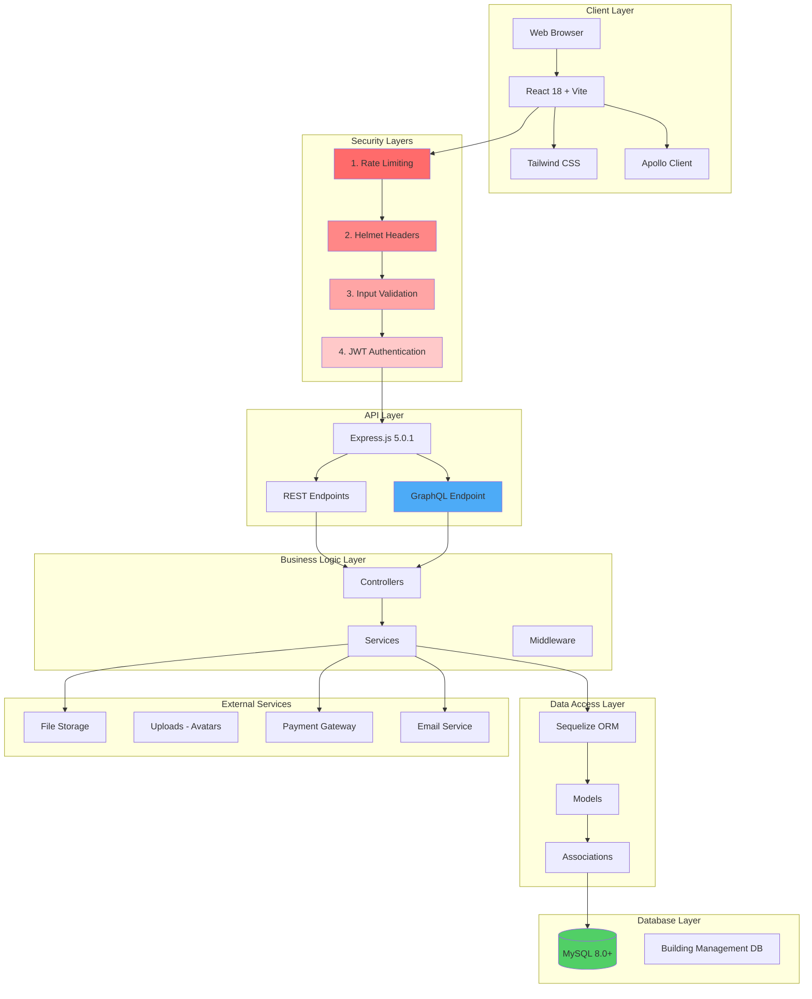
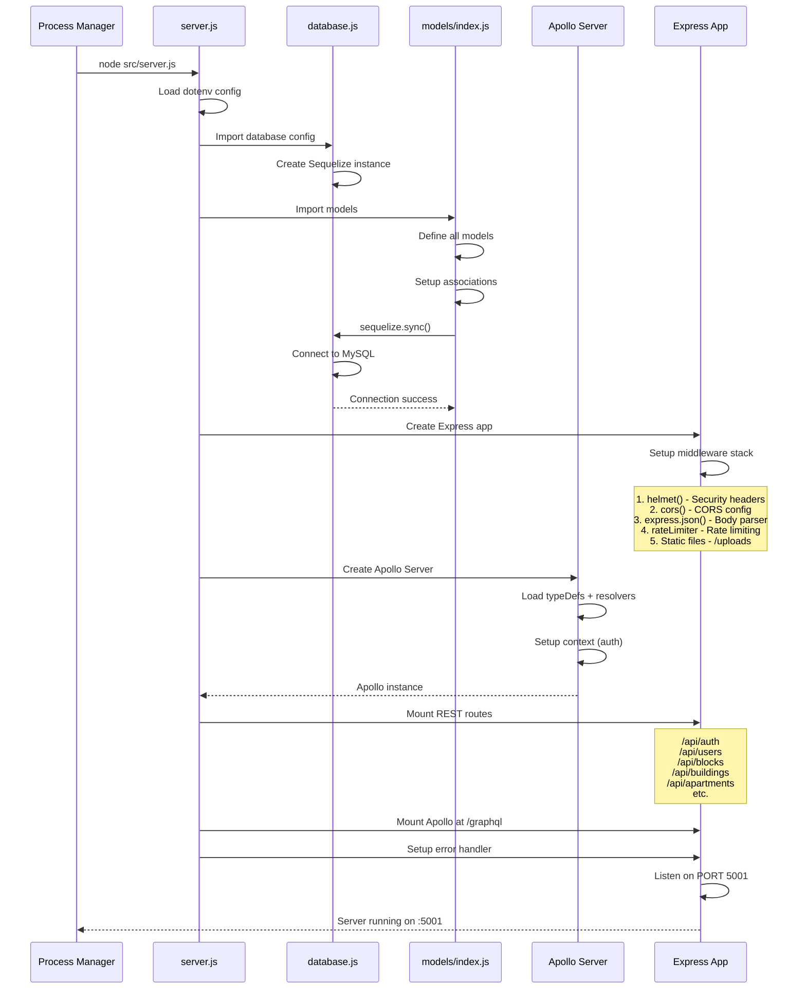
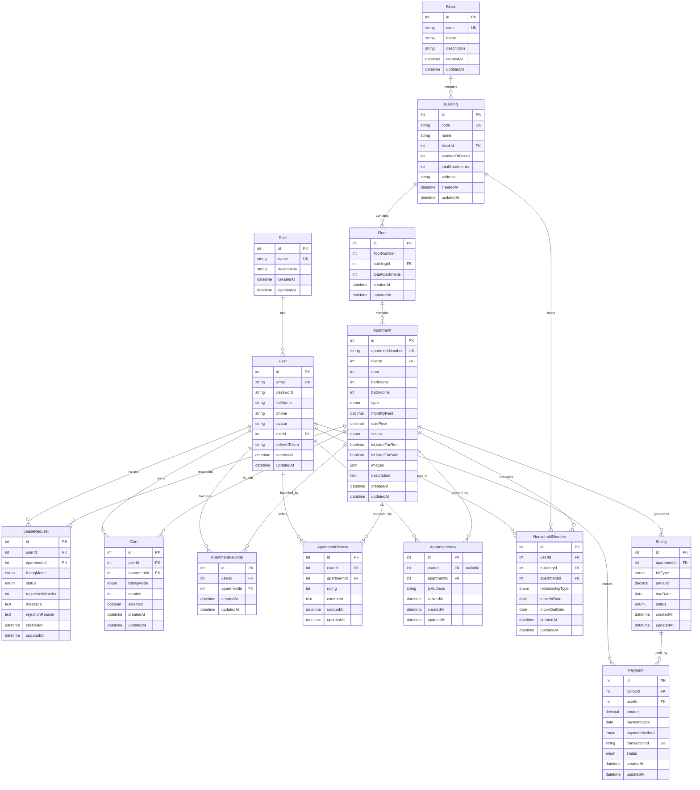
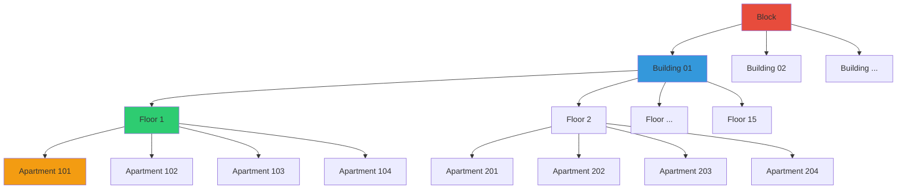
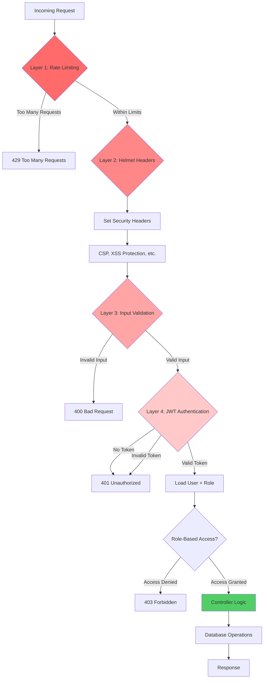

# lab05_ManageBuilding - System Architecture (Part 1: Backend & Database)

Tài liệu này mô tả kiến trúc tổng thể của hệ thống lab05_ManageBuilding, bao gồm backend architecture, database schema, và security layers.

## 📑 Mục lục Part 1

1. [System Overview](#1-system-overview)
2. [Backend Architecture](#2-backend-architecture)
3. [Database Schema & Relationships](#3-database-schema--relationships)
4. [4-Layer Security Architecture](#4-4-layer-security-architecture)
5. [API Structure](#5-api-structure)

---

## 1. System Overview

### 1.1 High-Level Architecture



### 1.2 Technology Stack Summary

| Layer | Technology | Version | Purpose |
|-------|-----------|---------|---------|
| **Frontend** | React | 18.3.1 | UI framework |
| | Vite | 6.0.11 | Build tool & dev server |
| | React Router DOM | 7.1.1 | Client-side routing |
| | Tailwind CSS | 3.4.17 | Utility-first CSS |
| | Heroicons | 2.2.0 | SVG icon library |
| | Apollo Client | 3.11.11 | GraphQL client |
| | react-hot-toast | 2.4.1 | Notifications |
| | Fuse.js | 7.0.0 | Fuzzy search |
| **Backend** | Node.js | 18+ | JavaScript runtime |
| | Express | 5.0.1 | Web framework |
| | Sequelize | 6.37.5 | ORM for MySQL |
| | Apollo Server | 4.11.3 | GraphQL server |
| | MySQL2 | 3.11.5 | MySQL driver |
| **Security** | bcryptjs | 2.4.3 | Password hashing |
| | jsonwebtoken | 9.0.2 | JWT tokens |
| | helmet | 8.0.0 | HTTP headers security |
| | express-rate-limit | 7.4.1 | Rate limiting |
| | express-validator | 7.2.0 | Input validation |
| **File Upload** | Multer | 1.4.5-lts.1 | File upload middleware |
| **Development** | nodemon | 3.1.9 | Auto-restart server |
| | dotenv | 16.4.7 | Environment variables |

---

## 2. Backend Architecture

### 2.1 Directory Structure

```
backend/
├── src/
│   ├── server.js                 # Entry point, Express app setup
│   ├── config/
│   │   └── database.js           # Sequelize connection config
│   ├── models/
│   │   ├── index.js              # Model associations & exports
│   │   ├── user.model.js         # User model
│   │   ├── role.model.js         # Role model
│   │   ├── block.model.js        # Block model
│   │   ├── building.model.js     # Building model
│   │   ├── floor.model.js        # Floor model
│   │   ├── apartment.model.js    # Apartment model
│   │   ├── cart.model.js         # Cart model
│   │   ├── leaseRequest.model.js # LeaseRequest model
│   │   ├── billing.model.js      # Billing model
│   │   ├── payment.model.js      # Payment model
│   │   ├── apartmentFavorite.model.js  # Favorite model
│   │   ├── apartmentReview.model.js    # Review model
│   │   └── apartmentView.model.js      # View tracking model
│   ├── controllers/
│   │   ├── auth.controller.js    # Login, register, refresh token
│   │   ├── user.controller.js    # User CRUD
│   │   ├── block.controller.js   # Block CRUD
│   │   ├── building.controller.js # Building CRUD
│   │   ├── floor.controller.js   # Floor CRUD
│   │   ├── apartment.controller.js # Apartment CRUD + search
│   │   ├── lease.controller.js   # Lease request workflow
│   │   ├── favorite.controller.js # Favorite operations
│   │   ├── review.controller.js  # Review CRUD
│   │   └── view.controller.js    # View tracking
│   ├── services/
│   │   ├── cart.service.js       # Cart business logic
│   │   ├── apartment.service.js  # Apartment operations + similarity
│   │   └── apartment.stats.service.js # Statistics aggregation
│   ├── graphql/
│   │   ├── cart.schema.js        # GraphQL type definitions
│   │   └── cart.resolvers.js     # GraphQL resolvers
│   ├── middleware/
│   │   ├── auth.js               # JWT verification + role checks
│   │   ├── rateLimiter.js        # Rate limiting config
│   │   ├── validation.js         # Input validation rules
│   │   └── errorHandler.js       # Global error handler
│   ├── routes/
│   │   ├── auth.routes.js        # /api/auth/*
│   │   ├── user.routes.js        # /api/users/*
│   │   ├── block.routes.js       # /api/blocks/*
│   │   ├── building.routes.js    # /api/buildings/*
│   │   ├── floor.routes.js       # /api/floors/*
│   │   ├── apartment.routes.js   # /api/apartments/*
│   │   ├── lease.routes.js       # /api/lease-requests/*
│   │   ├── favorite.routes.js    # /api/favorites/*
│   │   ├── review.routes.js      # /api/reviews/*
│   │   └── view.routes.js        # /api/views/*
│   ├── seeders/
│   │   └── index.js              # Database seeder (10 buildings + users)
│   └── utils/
│       ├── logger.js             # Winston logger
│       └── helpers.js            # Utility functions
└── uploads/
    └── avatars/                  # User avatar storage
```

### 2.2 Server Initialization Flow



---

## 3. Database Schema & Relationships

### 3.1 Complete Entity Relationship Diagram



### 3.2 Hierarchical Data Model



**Cascade Rules**:
- Delete Block → Delete all Buildings → Delete all Floors → Delete all Apartments
- Delete Building → Delete all Floors → Delete all Apartments
- Delete Floor → Delete all Apartments
- Delete Apartment → Delete Cart items, Favorites, Reviews, Views (CASCADE)
- Delete User → Nullify or restrict based on relationship

### 3.3 Key Database Constraints

```sql
-- Unique constraints
CONSTRAINT unique_block_code UNIQUE (code)
CONSTRAINT unique_building_code UNIQUE (code)
CONSTRAINT unique_apartment_number UNIQUE (apartmentNumber)
CONSTRAINT unique_user_email UNIQUE (email)
CONSTRAINT unique_user_apartment_favorite UNIQUE (userId, apartmentId)
CONSTRAINT unique_user_apartment_review UNIQUE (userId, apartmentId)
CONSTRAINT unique_payment_transaction UNIQUE (transactionId)

-- Foreign key constraints with cascade
CONSTRAINT fk_building_block FOREIGN KEY (blockId) REFERENCES Block(id) ON DELETE CASCADE
CONSTRAINT fk_floor_building FOREIGN KEY (buildingId) REFERENCES Building(id) ON DELETE CASCADE
CONSTRAINT fk_apartment_floor FOREIGN KEY (floorId) REFERENCES Floor(id) ON DELETE CASCADE
CONSTRAINT fk_cart_user FOREIGN KEY (userId) REFERENCES User(id) ON DELETE CASCADE
CONSTRAINT fk_cart_apartment FOREIGN KEY (apartmentId) REFERENCES Apartment(id) ON DELETE CASCADE

-- Enum constraints
CONSTRAINT apartment_type_enum CHECK (type IN ('studio', '1bhk', '2bhk', '3bhk', 'penthouse'))
CONSTRAINT apartment_status_enum CHECK (status IN ('vacant', 'occupied', 'maintenance', 'for_rent', 'for_sale'))
CONSTRAINT lease_status_enum CHECK (status IN ('pending', 'approved', 'rejected', 'cancelled'))
CONSTRAINT payment_status_enum CHECK (status IN ('pending', 'completed', 'failed', 'refunded'))

-- Check constraints
CONSTRAINT check_rating_range CHECK (rating >= 1 AND rating <= 5)
CONSTRAINT check_positive_area CHECK (area > 0)
CONSTRAINT check_positive_bedrooms CHECK (bedrooms > 0)
CONSTRAINT check_positive_amount CHECK (amount >= 0)
```

### 3.4 Database Indexes

```javascript
// Performance-critical indexes
Apartment.addIndex(['status']); // Filter by status frequently
Apartment.addIndex(['type']); // Filter by type
Apartment.addIndex(['floorId']); // Join with Floor
Apartment.addIndex(['isListedForRent', 'isListedForSale']); // Marketplace queries

Cart.addIndex(['userId']); // User's cart
Cart.addIndex(['apartmentId']); // Check apartment in cart

LeaseRequest.addIndex(['userId']); // User's requests
LeaseRequest.addIndex(['apartmentId']); // Apartment requests
LeaseRequest.addIndex(['status']); // Filter by status

ApartmentFavorite.addIndex(['userId']); // User's favorites
ApartmentFavorite.addIndex(['apartmentId']); // Apartment favorites count

ApartmentReview.addIndex(['apartmentId']); // Apartment reviews
ApartmentReview.addIndex(['rating']); // Average rating calculation

ApartmentView.addIndex(['apartmentId']); // View count
ApartmentView.addIndex(['userId', 'apartmentId', 'viewedAt']); // Deduplication
ApartmentView.addIndex(['ipAddress', 'apartmentId', 'viewedAt']); // Guest deduplication
```

---

## 4. 4-Layer Security Architecture

### 4.1 Security Layer Stack



### 4.2 Layer 1: Rate Limiting

**File**: `backend/src/middleware/rateLimiter.js`

```javascript
const rateLimit = require('express-rate-limit');

// Strict limiter for auth endpoints
const authLimiter = rateLimit({
  windowMs: 15 * 60 * 1000, // 15 minutes
  max: 5, // 5 requests per window
  message: 'Too many login attempts, please try again after 15 minutes',
  standardHeaders: true,
  legacyHeaders: false,
});

// General API limiter
const apiLimiter = rateLimit({
  windowMs: 15 * 60 * 1000, // 15 minutes
  max: 100, // 100 requests per window
  message: 'Too many requests, please try again later',
  standardHeaders: true,
  legacyHeaders: false,
});

module.exports = { authLimiter, apiLimiter };
```

**Usage**:
```javascript
// In routes
router.post('/login', authLimiter, authController.login);
router.use('/api', apiLimiter); // Apply to all API routes
```

### 4.3 Layer 2: Helmet Security Headers

**File**: `backend/src/server.js`

```javascript
const helmet = require('helmet');

app.use(helmet({
  contentSecurityPolicy: {
    directives: {
      defaultSrc: ["'self'"],
      styleSrc: ["'self'", "'unsafe-inline'"],
      scriptSrc: ["'self'"],
      imgSrc: ["'self'", "data:", "https:"],
      connectSrc: ["'self'"],
      fontSrc: ["'self'"],
      objectSrc: ["'none'"],
      upgradeInsecureRequests: [],
    },
  },
  hsts: {
    maxAge: 31536000,
    includeSubDomains: true,
    preload: true
  },
  noSniff: true,
  xssFilter: true,
  referrerPolicy: { policy: 'strict-origin-when-cross-origin' }
}));
```

**Headers Set**:
- `Content-Security-Policy`: XSS protection
- `Strict-Transport-Security`: Force HTTPS
- `X-Content-Type-Options`: Prevent MIME sniffing
- `X-Frame-Options`: Clickjacking protection
- `X-XSS-Protection`: Browser XSS filter
- `Referrer-Policy`: Control referrer info

### 4.4 Layer 3: Input Validation

**File**: `backend/src/middleware/validation.js`

```javascript
const { body, param, query, validationResult } = require('express-validator');

// Validation rules
const validateLogin = [
  body('email')
    .isEmail().withMessage('Invalid email format')
    .normalizeEmail(),
  body('password')
    .isLength({ min: 6 }).withMessage('Password must be at least 6 characters')
    .trim()
];

const validateApartmentSearch = [
  query('q').optional().trim().escape(),
  query('type').optional().isIn(['studio', '1bhk', '2bhk', '3bhk', 'penthouse']),
  query('bedrooms').optional().isInt({ min: 1 }),
  query('minArea').optional().isInt({ min: 1 }),
  query('maxArea').optional().isInt({ min: 1 }),
  query('minPrice').optional().isNumeric(),
  query('maxPrice').optional().isNumeric(),
  query('status').optional().isIn(['vacant', 'occupied', 'for_rent', 'for_sale']),
  query('page').optional().isInt({ min: 1 }).toInt(),
  query('limit').optional().isInt({ min: 1, max: 100 }).toInt()
];

const validateReview = [
  param('apartmentId').isInt(),
  body('rating').isInt({ min: 1, max: 5 }),
  body('comment').isLength({ min: 10, max: 2000 }).trim().escape()
];

// Validation error handler
const handleValidationErrors = (req, res, next) => {
  const errors = validationResult(req);
  if (!errors.isEmpty()) {
    return res.status(400).json({
      success: false,
      errors: errors.array()
    });
  }
  next();
};

module.exports = {
  validateLogin,
  validateApartmentSearch,
  validateReview,
  handleValidationErrors
};
```

### 4.5 Layer 4: JWT Authentication & Authorization

**File**: `backend/src/middleware/auth.js`

```javascript
const jwt = require('jsonwebtoken');
const { User, Role } = require('../models');

// Main auth middleware
const authMiddleware = async (req, res, next) => {
  try {
    const token = req.headers.authorization?.split(' ')[1];
    
    if (!token) {
      return res.status(401).json({
        success: false,
        message: 'No token provided'
      });
    }
    
    const decoded = jwt.verify(token, process.env.JWT_SECRET);
    
    const user = await User.findByPk(decoded.userId, {
      include: [{ model: Role, as: 'role' }]
    });
    
    if (!user) {
      return res.status(401).json({
        success: false,
        message: 'User not found'
      });
    }
    
    req.user = user;
    next();
  } catch (error) {
    if (error.name === 'TokenExpiredError') {
      return res.status(401).json({
        success: false,
        message: 'Token expired'
      });
    }
    return res.status(401).json({
      success: false,
      message: 'Invalid token'
    });
  }
};

// Optional auth (for guest + authenticated)
const optionalAuth = async (req, res, next) => {
  try {
    const token = req.headers.authorization?.split(' ')[1];
    
    if (token) {
      const decoded = jwt.verify(token, process.env.JWT_SECRET);
      const user = await User.findByPk(decoded.userId, {
        include: [{ model: Role, as: 'role' }]
      });
      
      if (user) {
        req.user = user;
      }
    }
    
    next();
  } catch (error) {
    next(); // Continue even if token invalid
  }
};

// Role-based access control
const requireRole = (allowedRoles) => {
  return (req, res, next) => {
    if (!req.user) {
      return res.status(401).json({
        success: false,
        message: 'Authentication required'
      });
    }
    
    const userRole = req.user.role.name;
    
    if (!allowedRoles.includes(userRole)) {
      return res.status(403).json({
        success: false,
        message: `Access denied. Required roles: ${allowedRoles.join(', ')}`
      });
    }
    
    next();
  };
};

module.exports = {
  authMiddleware,
  optionalAuth,
  requireRole
};
```

**Usage Examples**:
```javascript
// Public route - no auth
router.get('/apartments', apartmentController.getAll);

// Public + authenticated - optional auth
router.get('/buildings/map', optionalAuth, buildingController.getMap);

// Authenticated only
router.post('/favorites/:id', authMiddleware, favoriteController.add);

// Admin only
router.delete('/users/:id', authMiddleware, requireRole(['Admin']), userController.delete);

// Admin or Manager
router.put('/lease-requests/:id/status', 
  authMiddleware, 
  requireRole(['Admin', 'BuildingManager']), 
  leaseController.updateStatus
);
```

---

## 5. API Structure

### 5.1 REST API Endpoints

#### Authentication (`/api/auth`)
```
POST   /api/auth/register          - Register new user
POST   /api/auth/login             - Login (returns JWT tokens)
POST   /api/auth/refresh-token     - Refresh access token
POST   /api/auth/logout            - Logout (invalidate refresh token)
GET    /api/auth/me                - Get current user info
```

#### Users (`/api/users`)
```
GET    /api/users                  - Get all users (Admin only)
GET    /api/users/:id              - Get user by ID
PUT    /api/users/:id              - Update user
DELETE /api/users/:id              - Delete user (Admin only)
POST   /api/users/:id/avatar       - Upload avatar
```

#### Blocks (`/api/blocks`)
```
GET    /api/blocks                 - Get all blocks
GET    /api/blocks/:id             - Get block by ID
GET    /api/blocks/:id/buildings   - Get buildings in block
POST   /api/blocks                 - Create block (Admin/Manager)
PUT    /api/blocks/:id             - Update block (Admin/Manager)
DELETE /api/blocks/:id             - Delete block (Admin only)
```

#### Buildings (`/api/buildings`)
```
GET    /api/buildings              - Get all buildings
GET    /api/buildings/:id          - Get building by ID
GET    /api/buildings/:id/floors   - Get floors in building
GET    /api/buildings/:buildingId/apartments - Get all apartments in building
POST   /api/buildings              - Create building (Admin/Manager)
PUT    /api/buildings/:id          - Update building (Admin/Manager)
DELETE /api/buildings/:id          - Delete building (Admin only)
```

#### Floors (`/api/floors`)
```
GET    /api/floors                 - Get all floors
GET    /api/floors/:id             - Get floor by ID
GET    /api/floors/:id/apartments  - Get apartments on floor
POST   /api/floors                 - Create floor (Admin/Manager)
PUT    /api/floors/:id             - Update floor (Admin/Manager)
DELETE /api/floors/:id             - Delete floor (Admin only)
```

#### Apartments (`/api/apartments`)
```
GET    /api/apartments             - Get all apartments (with filters)
GET    /api/apartments/search      - Fuzzy search apartments
GET    /api/apartments/:id         - Get apartment by ID
GET    /api/apartments/:id/stats   - Get apartment statistics
GET    /api/apartments/:id/similar - Get similar apartments
POST   /api/apartments             - Create apartment (Admin/Manager)
PUT    /api/apartments/:id         - Update apartment (Admin/Manager)
DELETE /api/apartments/:id         - Delete apartment (Admin only)
```

#### Lease Requests (`/api/lease-requests`)
```
GET    /api/lease-requests         - Get all requests (filtered by role)
GET    /api/lease-requests/:id     - Get request by ID
POST   /api/lease-requests         - Create lease request (authenticated)
PUT    /api/lease-requests/:id/status - Update status (Admin/Manager)
DELETE /api/lease-requests/:id     - Cancel request (owner only)
```

#### Favorites (`/api/favorites`)
```
GET    /api/favorites              - Get user's favorites
POST   /api/favorites/:apartmentId - Add to favorites
DELETE /api/favorites/:apartmentId - Remove from favorites
```

#### Reviews (`/api/reviews`)
```
GET    /api/reviews/apartments/:apartmentId - Get reviews for apartment
POST   /api/reviews/apartments/:apartmentId - Create review (tenant/owner)
PUT    /api/reviews/:id            - Update own review
DELETE /api/reviews/:id             - Delete own review
```

#### Views (`/api/views`)
```
POST   /api/views/:apartmentId     - Track apartment view
GET    /api/views/apartments/:apartmentId/count - Get view count
```

### 5.2 GraphQL API (`/graphql`)

**Schema**: `backend/src/graphql/cart.schema.js`

```graphql
type CartItem {
  id: ID!
  userId: Int!
  apartmentId: Int!
  listingMode: String!
  months: Int
  selected: Boolean!
  createdAt: String!
  apartment: Apartment!
}

type Apartment {
  id: ID!
  apartmentNumber: String!
  area: Int!
  bedrooms: Int!
  bathrooms: Int!
  type: String!
  monthlyRent: Float
  salePrice: Float
  status: String!
  images: [String]
  description: String
  floor: Floor!
}

type Floor {
  floorNumber: Int!
  building: Building!
}

type Building {
  code: String!
  name: String!
  address: String
  block: Block!
}

type Block {
  code: String!
  name: String!
}

type CartSummary {
  totalRent: Float!
  totalBuy: Float!
  totalDeposit: Float!
  totalMaintenance: Float!
  grandTotal: Float!
}

type CartResponse {
  items: [CartItem!]!
  summary: CartSummary!
}

type CheckoutResult {
  success: Boolean!
  message: String!
  payments: [Payment]
  apartments: [Apartment]
}

type Query {
  myCart: CartResponse!
  cartSummary: CartSummary!
}

type Mutation {
  addToCart(apartmentId: Int!, listingMode: String!, months: Int): CartItem!
  updateCartItem(itemId: Int!, months: Int, selected: Boolean): CartItem!
  removeFromCart(itemId: Int!): Boolean!
  toggleCartItemSelection(itemId: Int!, selected: Boolean!): CartItem!
  selectAllCartItems(selected: Boolean!): [CartItem!]!
  clearCart: Boolean!
  checkoutCart(paymentMethod: String!, note: String): CheckoutResult!
}
```

**Resolver Functions**: `backend/src/graphql/cart.resolvers.js`

- `myCart`: Get user's cart with full associations
- `cartSummary`: Calculate totals for selected items
- `addToCart`: Add apartment to cart (check not already in cart)
- `updateCartItem`: Update months or selection
- `removeFromCart`: Remove item from cart
- `toggleCartItemSelection`: Toggle selection for checkout
- `selectAllCartItems`: Select/deselect all items
- `clearCart`: Remove all items
- `checkoutCart`: **Complex operation** - process payments, update apartments, upgrade user role

---

**Phần 1 hoàn thành!** File này bao gồm backend architecture, database schema với quan hệ, 4-layer security, và API structure chi tiết. 

**Tiếp theo**: ARCHITECTURE_PART2.md sẽ bao gồm Frontend Architecture, Component Structure, State Management, và Deployment Guide.
