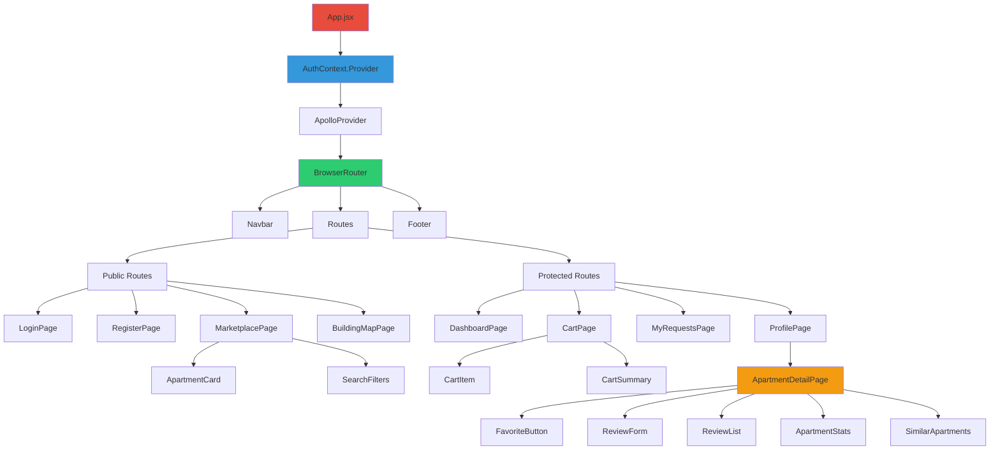
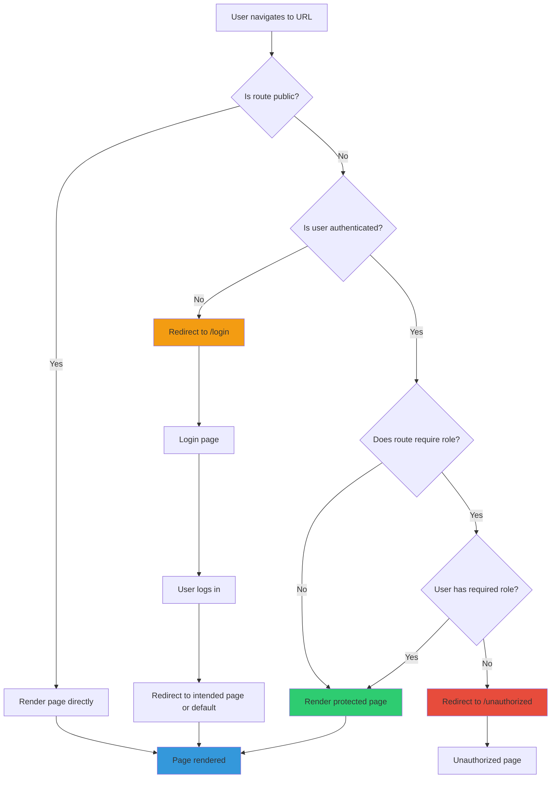

# lab05_ManageBuilding - System Architecture (Part 2: Frontend & Deployment)

Tài liệu này mô tả kiến trúc frontend, component structure, state management, và deployment guide cho hệ thống lab05_ManageBuilding.

## 📑 Mục lục Part 2

1. [Frontend Architecture](#1-frontend-architecture)
2. [Component Structure](#2-component-structure)
3. [State Management](#3-state-management)
4. [Routing Architecture](#4-routing-architecture)
5. [API Integration](#5-api-integration)
6. [Development Workflow](#6-development-workflow)
7. [Deployment Guide](#7-deployment-guide)

---

## 1. Frontend Architecture

### 1.1 Frontend Directory Structure

```
frontend/
├── src/
│   ├── main.jsx                    # Entry point, React app mount
│   ├── App.jsx                     # Root component with routes
│   ├── index.css                   # Global styles + Tailwind
│   ├── components/                 # Reusable UI components
│   │   ├── Navbar.jsx              # Navigation bar
│   │   ├── Footer.jsx              # Footer component
│   │   ├── LoadingSpinner.jsx     # Loading indicator
│   │   ├── ErrorBoundary.jsx      # Error boundary wrapper
│   │   ├── ProtectedRoute.jsx     # Route guard component
│   │   ├── FavoriteButton.jsx     # Favorite toggle button
│   │   ├── ReviewForm.jsx         # Review submission form
│   │   ├── ReviewList.jsx         # Review display list
│   │   ├── ApartmentStats.jsx     # Statistics cards
│   │   └── SimilarApartments.jsx  # Recommendation grid
│   ├── pages/                      # Page-level components
│   │   ├── auth/
│   │   │   ├── LoginPage.jsx      # Login form
│   │   │   └── RegisterPage.jsx   # Registration form
│   │   ├── dashboard/
│   │   │   └── DashboardPage.jsx  # Role-based dashboard
│   │   ├── buildings/
│   │   │   ├── BuildingListPage.jsx
│   │   │   ├── BuildingDetailPage.jsx
│   │   │   └── InteractiveBuildingMap.jsx  # 3D building map
│   │   ├── apartments/
│   │   │   ├── MarketplacePage.jsx         # Browse apartments
│   │   │   ├── ApartmentDetailPage.jsx     # Single apartment view
│   │   │   └── ApartmentSearchPage.jsx     # Search with filters
│   │   ├── cart/
│   │   │   └── CartPage.jsx        # Shopping cart
│   │   ├── lease/
│   │   │   ├── MyRequestsPage.jsx  # User's lease requests
│   │   │   └── ManageRequestsPage.jsx # Manager view
│   │   └── profile/
│   │       └── ProfilePage.jsx     # User profile
│   ├── contexts/
│   │   └── AuthContext.jsx         # Authentication state
│   ├── services/
│   │   ├── api.js                  # Axios instance config
│   │   ├── authAPI.js              # Auth endpoints
│   │   ├── apartmentAPI.js         # Apartment endpoints
│   │   ├── cartAPI.js              # GraphQL cart operations
│   │   ├── favoriteAPI.js          # Favorite endpoints
│   │   └── reviewAPI.js            # Review endpoints
│   └── styles/
│       ├── InteractiveBuildingMap.css  # 3D CSS transforms
│       └── custom.css              # Additional custom styles
├── public/
│   └── favicon.ico
├── index.html                      # HTML template
├── vite.config.js                  # Vite configuration
├── tailwind.config.js              # Tailwind CSS config
└── package.json
```

### 1.2 Frontend Technology Stack Details

```mermaid
graph TD
    A[React 18] --> B[Component Library]
    A --> C[Hooks API]
    
    B --> D[Functional Components]
    C --> E[useState, useEffect, useContext, useCallback, useMemo]
    
    F[Routing] --> G[React Router DOM v7]
    G --> H[BrowserRouter]
    G --> I[Protected Routes]
    
    J[State Management] --> K[Context API]
    K --> L[AuthContext]
    K --> M[Apollo Client Cache]
    
    N[Styling] --> O[Tailwind CSS]
    O --> P[Utility Classes]
    O --> Q[Responsive Design]
    
    N --> R[Custom CSS]
    R --> S[3D Transforms]
    R --> T[Animations]
    
    U[Data Fetching] --> V[Axios for REST]
    U --> W[Apollo Client for GraphQL]
    
    X[UI Libraries] --> Y[Heroicons]
    X --> Z[react-hot-toast]
    
    AA[Dev Tools] --> AB[Vite]
    AB --> AC[Hot Module Replacement]
    AB --> AD[Fast Build]
    
    style A fill:#61dafb
    style F fill:#ca4245
    style J fill:#764abc
    style N fill:#06b6d4
    style U fill:#5a67d8
```



### 1.3 Build & Dev Server Configuration

**File**: `frontend/vite.config.js`

```javascript
import { defineConfig } from 'vite';
import react from '@vitejs/plugin-react';

export default defineConfig({
  plugins: [react()],
  server: {
    port: 3000,
    proxy: {
      '/api': {
        target: 'http://localhost:5001',
        changeOrigin: true,
      },
      '/graphql': {
        target: 'http://localhost:5001',
        changeOrigin: true,
      },
    },
  },
  build: {
    outDir: 'dist',
    sourcemap: true,
    rollupOptions: {
      output: {
        manualChunks: {
          'react-vendor': ['react', 'react-dom', 'react-router-dom'],
          'apollo-vendor': ['@apollo/client', 'graphql'],
        },
      },
    },
  },
});
```

**Key Features**:
- **Dev Server**: Port 3000 with HMR
- **Proxy**: Forwards `/api` and `/graphql` to backend `:5001`
- **Code Splitting**: Separate vendor chunks for better caching
- **Source Maps**: Enabled for debugging production builds

---

## 2. Component Structure

### 2.1 Component Hierarchy



### 2.2 Key Component Patterns

#### Pattern 1: Container/Presentational Components

```jsx
// Container Component (Smart - handles logic)
const MarketplacePage = () => {
  const [apartments, setApartments] = useState([]);
  const [loading, setLoading] = useState(true);
  const [filters, setFilters] = useState({});
  
  useEffect(() => {
    fetchApartments();
  }, [filters]);
  
  const fetchApartments = async () => {
    // API logic
  };
  
  return <ApartmentGrid apartments={apartments} loading={loading} />;
};

// Presentational Component (Dumb - renders UI)
const ApartmentGrid = ({ apartments, loading }) => {
  if (loading) return <LoadingSpinner />;
  
  return (
    <div className="grid grid-cols-1 md:grid-cols-2 lg:grid-cols-3 gap-6">
      {apartments.map(apt => (
        <ApartmentCard key={apt.id} apartment={apt} />
      ))}
    </div>
  );
};
```

#### Pattern 2: Custom Hooks

```jsx
// Custom hook for apartment operations
const useApartment = (apartmentId) => {
  const [apartment, setApartment] = useState(null);
  const [loading, setLoading] = useState(true);
  const [error, setError] = useState(null);
  
  useEffect(() => {
    const fetchApartment = async () => {
      try {
        setLoading(true);
        const response = await apartmentAPI.getById(apartmentId);
        setApartment(response.data.data);
      } catch (err) {
        setError(err.message);
      } finally {
        setLoading(false);
      }
    };
    
    fetchApartment();
  }, [apartmentId]);
  
  return { apartment, loading, error };
};

// Usage
const ApartmentDetailPage = () => {
  const { id } = useParams();
  const { apartment, loading, error } = useApartment(id);
  
  if (loading) return <LoadingSpinner />;
  if (error) return <ErrorMessage message={error} />;
  
  return <ApartmentDetail apartment={apartment} />;
};
```

#### Pattern 3: Render Props

```jsx
// Error Boundary with render prop
const ErrorBoundary = ({ children, fallback }) => {
  const [hasError, setHasError] = useState(false);
  
  useEffect(() => {
    const errorHandler = (error) => {
      console.error('Error caught:', error);
      setHasError(true);
    };
    
    window.addEventListener('error', errorHandler);
    return () => window.removeEventListener('error', errorHandler);
  }, []);
  
  if (hasError) {
    return fallback ? fallback : <DefaultErrorUI />;
  }
  
  return children;
};

// Usage
<ErrorBoundary fallback={<CustomError />}>
  <ApartmentDetailPage />
</ErrorBoundary>
```

### 2.3 Reusable Component Library

#### LoadingSpinner Component

```jsx
const LoadingSpinner = ({ size = 'md', message = 'Loading...' }) => {
  const sizeClasses = {
    sm: 'w-4 h-4',
    md: 'w-8 h-8',
    lg: 'w-12 h-12',
  };
  
  return (
    <div className="flex flex-col items-center justify-center p-8">
      <div className={`animate-spin rounded-full border-4 border-gray-300 border-t-blue-600 ${sizeClasses[size]}`} />
      {message && <p className="mt-4 text-gray-600">{message}</p>}
    </div>
  );
};
```

#### Button Component with Variants

```jsx
const Button = ({ 
  children, 
  variant = 'primary', 
  size = 'md', 
  loading = false,
  disabled = false,
  onClick,
  ...props 
}) => {
  const baseClasses = 'font-medium rounded-lg transition-colors focus:outline-none focus:ring-2';
  
  const variantClasses = {
    primary: 'bg-blue-600 text-white hover:bg-blue-700 focus:ring-blue-500',
    secondary: 'bg-gray-200 text-gray-800 hover:bg-gray-300 focus:ring-gray-500',
    danger: 'bg-red-600 text-white hover:bg-red-700 focus:ring-red-500',
    ghost: 'bg-transparent text-blue-600 hover:bg-blue-50 focus:ring-blue-500',
  };
  
  const sizeClasses = {
    sm: 'px-3 py-1.5 text-sm',
    md: 'px-4 py-2 text-base',
    lg: 'px-6 py-3 text-lg',
  };
  
  return (
    <button
      className={`${baseClasses} ${variantClasses[variant]} ${sizeClasses[size]} ${
        (disabled || loading) ? 'opacity-50 cursor-not-allowed' : ''
      }`}
      disabled={disabled || loading}
      onClick={onClick}
      {...props}
    >
      {loading ? (
        <div className="flex items-center gap-2">
          <LoadingSpinner size="sm" />
          <span>Loading...</span>
        </div>
      ) : (
        children
      )}
    </button>
  );
};
```

#### Modal Component

```jsx
const Modal = ({ isOpen, onClose, title, children, footer }) => {
  if (!isOpen) return null;
  
  return (
    <div className="fixed inset-0 z-50 overflow-y-auto">
      {/* Backdrop */}
      <div 
        className="fixed inset-0 bg-black bg-opacity-50 transition-opacity"
        onClick={onClose}
      />
      
      {/* Modal */}
      <div className="flex items-center justify-center min-h-screen p-4">
        <div className="relative bg-white rounded-lg shadow-xl max-w-lg w-full p-6">
          {/* Header */}
          <div className="flex items-center justify-between mb-4">
            <h3 className="text-xl font-semibold">{title}</h3>
            <button
              onClick={onClose}
              className="text-gray-400 hover:text-gray-600"
            >
              <XMarkIcon className="w-6 h-6" />
            </button>
          </div>
          
          {/* Content */}
          <div className="mb-4">{children}</div>
          
          {/* Footer */}
          {footer && <div className="flex justify-end gap-2">{footer}</div>}
        </div>
      </div>
    </div>
  );
};
```

---

## 3. State Management

### 3.1 Authentication State with Context API

**File**: `frontend/src/contexts/AuthContext.jsx`

```jsx
import React, { createContext, useContext, useState, useEffect } from 'react';
import { authAPI } from '../services/authAPI';

const AuthContext = createContext();

export const useAuth = () => {
  const context = useContext(AuthContext);
  if (!context) {
    throw new Error('useAuth must be used within AuthProvider');
  }
  return context;
};

export const AuthProvider = ({ children }) => {
  const [user, setUser] = useState(null);
  const [loading, setLoading] = useState(true);
  
  // Initialize auth state from localStorage
  useEffect(() => {
    const initAuth = async () => {
      const token = localStorage.getItem('lab05_token');
      
      if (token) {
        try {
          const response = await authAPI.getCurrentUser();
          setUser(response.data.data);
        } catch (error) {
          console.error('Failed to load user:', error);
          localStorage.removeItem('lab05_token');
          localStorage.removeItem('lab05_refreshToken');
        }
      }
      
      setLoading(false);
    };
    
    initAuth();
  }, []);
  
  const login = async (email, password) => {
    const response = await authAPI.login(email, password);
    const { accessToken, refreshToken, user } = response.data.data;
    
    localStorage.setItem('lab05_token', accessToken);
    localStorage.setItem('lab05_refreshToken', refreshToken);
    setUser(user);
    
    return user;
  };
  
  const logout = async () => {
    try {
      await authAPI.logout();
    } catch (error) {
      console.error('Logout error:', error);
    }
    
    localStorage.removeItem('lab05_token');
    localStorage.removeItem('lab05_refreshToken');
    setUser(null);
  };
  
  const register = async (userData) => {
    const response = await authAPI.register(userData);
    const { accessToken, refreshToken, user } = response.data.data;
    
    localStorage.setItem('lab05_token', accessToken);
    localStorage.setItem('lab05_refreshToken', refreshToken);
    setUser(user);
    
    return user;
  };
  
  const value = {
    user,
    loading,
    login,
    logout,
    register,
    isAuthenticated: !!user,
    isAdmin: user?.role?.name === 'Admin',
    isManager: user?.role?.name === 'BuildingManager',
    isResident: user?.role?.name === 'Resident',
  };
  
  return (
    <AuthContext.Provider value={value}>
      {children}
    </AuthContext.Provider>
  );
};
```

**Usage**:
```jsx
const LoginPage = () => {
  const { login } = useAuth();
  const navigate = useNavigate();
  
  const handleSubmit = async (e) => {
    e.preventDefault();
    try {
      const user = await login(email, password);
      toast.success('Login successful!');
      
      // Redirect based on role
      if (user.role.name === 'Admin' || user.role.name === 'BuildingManager') {
        navigate('/dashboard');
      } else {
        navigate('/marketplace');
      }
    } catch (error) {
      toast.error(error.response?.data?.message || 'Login failed');
    }
  };
  
  return <form onSubmit={handleSubmit}>...</form>;
};
```

### 3.2 Apollo Client for GraphQL State

**File**: `frontend/src/main.jsx`

```jsx
import { ApolloClient, InMemoryCache, ApolloProvider, createHttpLink } from '@apollo/client';
import { setContext } from '@apollo/client/link/context';

// HTTP connection to GraphQL API
const httpLink = createHttpLink({
  uri: 'http://localhost:5001/graphql',
});

// Add auth token to requests
const authLink = setContext((_, { headers }) => {
  const token = localStorage.getItem('lab05_token');
  
  return {
    headers: {
      ...headers,
      authorization: token ? `Bearer ${token}` : '',
    }
  };
});

// Create Apollo Client
const apolloClient = new ApolloClient({
  link: authLink.concat(httpLink),
  cache: new InMemoryCache({
    typePolicies: {
      Query: {
        fields: {
          myCart: {
            merge(existing, incoming) {
              return incoming;
            },
          },
        },
      },
    },
  }),
});

// Wrap app with providers
ReactDOM.createRoot(document.getElementById('root')).render(
  <React.StrictMode>
    <AuthProvider>
      <ApolloProvider client={apolloClient}>
        <App />
      </ApolloProvider>
    </AuthProvider>
  </React.StrictMode>
);
```

**GraphQL Query Example**:
```jsx
import { useQuery, useMutation } from '@apollo/client';
import { gql } from '@apollo/client';

const GET_MY_CART = gql`
  query MyCart {
    myCart {
      items {
        id
        listingMode
        months
        selected
        apartment {
          id
          apartmentNumber
          monthlyRent
          salePrice
          images
        }
      }
      summary {
        totalRent
        totalBuy
        grandTotal
      }
    }
  }
`;

const CHECKOUT_CART = gql`
  mutation CheckoutCart($paymentMethod: String!, $note: String) {
    checkoutCart(paymentMethod: $paymentMethod, note: $note) {
      success
      message
      payments {
        id
        transactionId
        amount
      }
    }
  }
`;

const CartPage = () => {
  const { data, loading, error, refetch } = useQuery(GET_MY_CART);
  const [checkout, { loading: checkoutLoading }] = useMutation(CHECKOUT_CART);
  
  const handleCheckout = async () => {
    try {
      const result = await checkout({
        variables: {
          paymentMethod: 'credit_card',
          note: 'Online payment'
        }
      });
      
      if (result.data.checkoutCart.success) {
        toast.success('Checkout successful!');
        navigate('/my-apartments');
      }
    } catch (err) {
      toast.error(err.message);
    }
  };
  
  if (loading) return <LoadingSpinner />;
  if (error) return <ErrorMessage message={error.message} />;
  
  return (
    <div>
      {data.myCart.items.map(item => (
        <CartItem key={item.id} item={item} />
      ))}
      <CartSummary summary={data.myCart.summary} />
      <Button onClick={handleCheckout} loading={checkoutLoading}>
        Checkout
      </Button>
    </div>
  );
};
```

---

## 4. Routing Architecture

### 4.1 Route Configuration

**File**: `frontend/src/App.jsx`

```jsx
import { BrowserRouter, Routes, Route, Navigate } from 'react-router-dom';
import { useAuth } from './contexts/AuthContext';

// Protected Route Component
const ProtectedRoute = ({ children, allowedRoles = [] }) => {
  const { user, loading } = useAuth();
  
  if (loading) {
    return <LoadingSpinner />;
  }
  
  if (!user) {
    return <Navigate to="/login" replace />;
  }
  
  if (allowedRoles.length > 0 && !allowedRoles.includes(user.role.name)) {
    return <Navigate to="/unauthorized" replace />;
  }
  
  return children;
};

function App() {
  return (
    <BrowserRouter>
      <div className="min-h-screen flex flex-col">
        <Navbar />
        
        <main className="flex-1">
          <Routes>
            {/* Public Routes */}
            <Route path="/" element={<HomePage />} />
            <Route path="/login" element={<LoginPage />} />
            <Route path="/register" element={<RegisterPage />} />
            <Route path="/marketplace" element={<MarketplacePage />} />
            <Route path="/buildings/map" element={<BuildingMapPage />} />
            <Route path="/apartments/:id" element={<ApartmentDetailPage />} />
            
            {/* Protected Routes - Any Authenticated User */}
            <Route path="/dashboard" element={
              <ProtectedRoute>
                <DashboardPage />
              </ProtectedRoute>
            } />
            
            <Route path="/cart" element={
              <ProtectedRoute>
                <CartPage />
              </ProtectedRoute>
            } />
            
            <Route path="/my-requests" element={
              <ProtectedRoute>
                <MyRequestsPage />
              </ProtectedRoute>
            } />
            
            <Route path="/profile" element={
              <ProtectedRoute>
                <ProfilePage />
              </ProtectedRoute>
            } />
            
            {/* Admin/Manager Only Routes */}
            <Route path="/admin/users" element={
              <ProtectedRoute allowedRoles={['Admin']}>
                <UserManagementPage />
              </ProtectedRoute>
            } />
            
            <Route path="/admin/lease-requests" element={
              <ProtectedRoute allowedRoles={['Admin', 'BuildingManager']}>
                <ManageRequestsPage />
              </ProtectedRoute>
            } />
            
            {/* Error Routes */}
            <Route path="/unauthorized" element={<UnauthorizedPage />} />
            <Route path="*" element={<NotFoundPage />} />
          </Routes>
        </main>
        
        <Footer />
      </div>
    </BrowserRouter>
  );
}
```

### 4.2 Route Navigation Flow



---

## 5. API Integration

### 5.1 Axios Instance Configuration

**File**: `frontend/src/services/api.js`

```javascript
import axios from 'axios';
import toast from 'react-hot-toast';

const api = axios.create({
  baseURL: 'http://localhost:5001',
  headers: {
    'Content-Type': 'application/json',
  },
});

// Request interceptor - Add auth token
api.interceptors.request.use(
  (config) => {
    const token = localStorage.getItem('lab05_token');
    
    if (token) {
      config.headers.Authorization = `Bearer ${token}`;
    }
    
    return config;
  },
  (error) => {
    return Promise.reject(error);
  }
);

// Response interceptor - Handle errors and token refresh
api.interceptors.response.use(
  (response) => {
    return response;
  },
  async (error) => {
    const originalRequest = error.config;
    
    // Handle 401 - Try to refresh token
    if (error.response?.status === 401 && !originalRequest._retry) {
      originalRequest._retry = true;
      
      try {
        const refreshToken = localStorage.getItem('lab05_refreshToken');
        
        if (!refreshToken) {
          throw new Error('No refresh token');
        }
        
        const response = await axios.post('http://localhost:5001/api/auth/refresh-token', {
          refreshToken
        });
        
        const { accessToken } = response.data.data;
        localStorage.setItem('lab05_token', accessToken);
        
        originalRequest.headers.Authorization = `Bearer ${accessToken}`;
        return api(originalRequest);
      } catch (refreshError) {
        // Refresh failed - logout
        localStorage.removeItem('lab05_token');
        localStorage.removeItem('lab05_refreshToken');
        window.location.href = '/login';
        return Promise.reject(refreshError);
      }
    }
    
    // Handle network errors
    if (!error.response) {
      toast.error('Network error. Please check your connection.');
      return Promise.reject(new Error('Network error'));
    }
    
    // Handle other errors
    const message = error.response?.data?.message || 'An error occurred';
    toast.error(message);
    
    return Promise.reject(error);
  }
);

export default api;
```

### 5.2 API Service Modules

**File**: `frontend/src/services/apartmentAPI.js`

```javascript
import api from './api';

export const apartmentAPI = {
  // Get all apartments with filters
  getAll: (filters = {}) => {
    return api.get('/api/apartments', { params: filters });
  },
  
  // Search apartments (fuzzy search)
  search: (query, filters = {}) => {
    return api.get('/api/apartments/search', {
      params: { q: query, ...filters }
    });
  },
  
  // Get apartment by ID
  getById: (id) => {
    return api.get(`/api/apartments/${id}`);
  },
  
  // Get apartment statistics
  getStats: (id) => {
    return api.get(`/api/apartments/${id}/stats`);
  },
  
  // Get similar apartments
  getSimilar: (id, limit = 6) => {
    return api.get(`/api/apartments/${id}/similar`, { params: { limit } });
  },
  
  // Create apartment (admin/manager)
  create: (data) => {
    return api.post('/api/apartments', data);
  },
  
  // Update apartment (admin/manager)
  update: (id, data) => {
    return api.put(`/api/apartments/${id}`, data);
  },
  
  // Delete apartment (admin)
  delete: (id) => {
    return api.delete(`/api/apartments/${id}`);
  },
};
```

**File**: `frontend/src/services/favoriteAPI.js`

```javascript
import api from './api';

export const favoriteAPI = {
  // Get user's favorites
  getMyFavorites: () => {
    return api.get('/api/favorites');
  },
  
  // Add to favorites
  add: (apartmentId) => {
    return api.post(`/api/favorites/${apartmentId}`);
  },
  
  // Remove from favorites
  remove: (apartmentId) => {
    return api.delete(`/api/favorites/${apartmentId}`);
  },
  
  // Check if apartment is favorited
  checkFavorite: async (apartmentId) => {
    try {
      const response = await api.get('/api/favorites');
      return response.data.data.some(fav => fav.apartmentId === apartmentId);
    } catch (error) {
      return false;
    }
  },
};
```

---

## 6. Development Workflow

### 6.1 Local Development Setup

```bash
# 1. Clone repository
git clone https://github.com/Killig3110/22110118_HuynhThanhDuy_MTSE.git
cd 22110118_HuynhThanhDuy_MTSE/lab05_ManageBuilding

# 2. Setup backend
cd backend
npm install
cp .env.example .env
# Edit .env with your MySQL credentials

# 3. Setup database
npm run seed

# 4. Start backend server
npm run dev
# Backend running on http://localhost:5001

# 5. In new terminal, setup frontend
cd ../frontend
npm install

# 6. Start frontend dev server
npm run dev
# Frontend running on http://localhost:3000
```

### 6.2 Environment Variables

**Backend** (`.env`):
```env
# Server
PORT=5001
NODE_ENV=development

# Database
DB_HOST=localhost
DB_PORT=3306
DB_NAME=building_management
DB_USER=root
DB_PASSWORD=your_password

# JWT
JWT_SECRET=your_super_secret_jwt_key_here
JWT_EXPIRES_IN=15m
JWT_REFRESH_SECRET=your_refresh_token_secret_here
JWT_REFRESH_EXPIRES_IN=7d

# File Upload
UPLOAD_DIR=uploads/avatars
MAX_FILE_SIZE=5242880

# Rate Limiting
RATE_LIMIT_WINDOW_MS=900000
RATE_LIMIT_MAX_REQUESTS=100
```

**Frontend** (`.env`):
```env
VITE_API_URL=http://localhost:5001
VITE_GRAPHQL_URL=http://localhost:5001/graphql
```

### 6.3 Development Scripts

**Backend** (`package.json`):
```json
{
  "scripts": {
    "start": "node src/server.js",
    "dev": "nodemon src/server.js",
    "seed": "node src/seeders/index.js",
    "test": "jest",
    "lint": "eslint src/**/*.js"
  }
}
```

**Frontend** (`package.json`):
```json
{
  "scripts": {
    "dev": "vite",
    "build": "vite build",
    "preview": "vite preview",
    "lint": "eslint src --ext js,jsx",
    "format": "prettier --write \"src/**/*.{js,jsx}\""
  }
}
```

---

## 7. Deployment Guide

### 7.1 Production Build Process


### 7.2 Docker Deployment

**File**: `docker-compose.yml`

```yaml
version: '3.8'

services:
  # MySQL Database
  mysql:
    image: mysql:8.0
    container_name: building_management_db
    environment:
      MYSQL_ROOT_PASSWORD: ${DB_PASSWORD}
      MYSQL_DATABASE: ${DB_NAME}
    ports:
      - "3306:3306"
    volumes:
      - mysql_data:/var/lib/mysql
    networks:
      - app_network
    healthcheck:
      test: ["CMD", "mysqladmin", "ping", "-h", "localhost"]
      interval: 10s
      timeout: 5s
      retries: 5

  # Backend API
  backend:
    build:
      context: ./backend
      dockerfile: Dockerfile
    container_name: building_management_api
    environment:
      PORT: 5001
      DB_HOST: mysql
      DB_PORT: 3306
      DB_NAME: ${DB_NAME}
      DB_USER: root
      DB_PASSWORD: ${DB_PASSWORD}
      JWT_SECRET: ${JWT_SECRET}
      JWT_REFRESH_SECRET: ${JWT_REFRESH_SECRET}
    ports:
      - "5001:5001"
    depends_on:
      mysql:
        condition: service_healthy
    volumes:
      - ./backend/uploads:/app/uploads
    networks:
      - app_network
    restart: unless-stopped

  # Frontend
  frontend:
    build:
      context: ./frontend
      dockerfile: Dockerfile
    container_name: building_management_frontend
    ports:
      - "80:80"
    depends_on:
      - backend
    networks:
      - app_network
    restart: unless-stopped

volumes:
  mysql_data:

networks:
  app_network:
    driver: bridge
```

**Backend Dockerfile**:
```dockerfile
FROM node:18-alpine

WORKDIR /app

COPY package*.json ./
RUN npm ci --only=production

COPY . .

EXPOSE 5001

CMD ["node", "src/server.js"]
```

**Frontend Dockerfile**:
```dockerfile
# Build stage
FROM node:18-alpine AS builder

WORKDIR /app

COPY package*.json ./
RUN npm ci

COPY . .
RUN npm run build

# Production stage
FROM nginx:alpine

COPY --from=builder /app/dist /usr/share/nginx/html
COPY nginx.conf /etc/nginx/conf.d/default.conf

EXPOSE 80

CMD ["nginx", "-g", "daemon off;"]
```

**Nginx Configuration** (`nginx.conf`):
```nginx
server {
    listen 80;
    server_name localhost;
    root /usr/share/nginx/html;
    index index.html;

    # Gzip compression
    gzip on;
    gzip_types text/plain text/css application/json application/javascript text/xml application/xml application/xml+rss text/javascript;

    # Frontend routes
    location / {
        try_files $uri $uri/ /index.html;
    }

    # API proxy
    location /api {
        proxy_pass http://backend:5001;
        proxy_http_version 1.1;
        proxy_set_header Upgrade $http_upgrade;
        proxy_set_header Connection 'upgrade';
        proxy_set_header Host $host;
        proxy_cache_bypass $http_upgrade;
    }

    # GraphQL proxy
    location /graphql {
        proxy_pass http://backend:5001;
        proxy_http_version 1.1;
        proxy_set_header Upgrade $http_upgrade;
        proxy_set_header Connection 'upgrade';
        proxy_set_header Host $host;
        proxy_cache_bypass $http_upgrade;
    }

    # Static files caching
    location ~* \.(js|css|png|jpg|jpeg|gif|ico|svg)$ {
        expires 1y;
        add_header Cache-Control "public, immutable";
    }
}
```

### 7.3 Deployment Commands

```bash
# Build and start all services
docker-compose up -d --build

# View logs
docker-compose logs -f

# Run database seeder (first time only)
docker-compose exec backend npm run seed

# Stop services
docker-compose down

# Stop and remove volumes
docker-compose down -v

# Restart a specific service
docker-compose restart backend

# Scale services (if needed)
docker-compose up -d --scale backend=3
```

### 7.4 Health Check & Monitoring

```javascript
// Add health check endpoint in backend
app.get('/health', async (req, res) => {
  try {
    // Check database connection
    await sequelize.authenticate();
    
    res.status(200).json({
      status: 'healthy',
      timestamp: new Date().toISOString(),
      uptime: process.uptime(),
      database: 'connected'
    });
  } catch (error) {
    res.status(503).json({
      status: 'unhealthy',
      timestamp: new Date().toISOString(),
      error: error.message
    });
  }
});
```

### 7.5 Production Checklist

- [ ] Set strong JWT secrets in production `.env`
- [ ] Enable HTTPS with SSL certificates (Let's Encrypt)
- [ ] Configure CORS for production domain
- [ ] Set up database backups (daily automated)
- [ ] Enable rate limiting on all endpoints
- [ ] Configure log aggregation (Winston + CloudWatch/ELK)
- [ ] Set up error tracking (Sentry)
- [ ] Enable monitoring (Prometheus + Grafana)
- [ ] Configure CDN for static assets
- [ ] Set up CI/CD pipeline (GitHub Actions/Jenkins)
- [ ] Perform security audit (npm audit, OWASP)
- [ ] Load test with realistic traffic (k6, JMeter)

---

## 📊 Summary

Part 2 này bao gồm:

1. **Frontend Architecture**: Component hierarchy, technology stack, Vite configuration
2. **Component Structure**: Patterns (container/presentational, custom hooks, render props), reusable library
3. **State Management**: AuthContext với Context API, Apollo Client cho GraphQL
4. **Routing**: Protected routes, role-based access, navigation flow
5. **API Integration**: Axios instance với interceptors, token refresh, service modules
6. **Development Workflow**: Local setup, environment variables, development scripts
7. **Deployment Guide**: Docker configuration, production build, health checks, monitoring

**Key Highlights**:
- ✅ **Scalable architecture**: Modular, reusable components
- ✅ **Security**: JWT with refresh tokens, role-based access control
- ✅ **Performance**: Code splitting, lazy loading, caching strategies
- ✅ **Developer Experience**: HMR, TypeScript-ready, ESLint + Prettier
- ✅ **Production-Ready**: Docker deployment, health checks, monitoring

**Toàn bộ documentation lab05_ManageBuilding hoàn thành!** 🎉

---

**Các files đã tạo**:
1. BT01.md - BT08.md + BT08_PART2.md (8 files - yêu cầu đề bài)
2. WORKFLOW_DIAGRAMS.md (comprehensive workflows)
3. ARCHITECTURE.md (Part 1: Backend & Database)
4. ARCHITECTURE_PART2.md (Part 2: Frontend & Deployment)

**Total: 11 comprehensive documentation files!** 🚀
