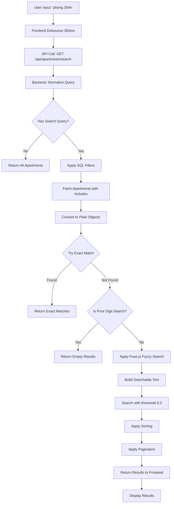

# BT06: Fuzzy Search và Advanced Filtering

## 📋 Yêu cầu đề bài
- Implement fuzzy search (tìm kiếm mờ) cho hệ thống
- Hỗ trợ tìm kiếm với typo và dấu thanh tiếng Việt
- Multiple filters kết hợp (type, price range, area, bedrooms, status)
- Sorting và pagination cho kết quả
- Search optimization để tránh false positives

## ✅ Những gì đã thực hiện

### 📍 Implementation trong lab05_ManageBuilding

#### Tech Stack
```json
{
  "fuse.js": "^7.1.0",               // Fuzzy search library
  "sequelize": "^6.34.0",            // Database ORM
  "express": "^4.18.2"               // Web framework
}
```

## 🔧 Chi tiết Implementation

### 1. Backend - Fuzzy Search với Fuse.js

#### Search Controller
**📍 File:** `backend/src/controllers/apartment.controller.js`

```javascript
const { Op } = require('sequelize');
const Fuse = require('fuse.js');
const { Apartment, Floor, Building } = require('../models');

// Helper: Normalize text (remove diacritics, lowercase)
const normalize = (text = '') =>
    text
        .toString()
        .normalize('NFD')                    // Decompose Unicode
        .replace(/\p{Diacritic}/gu, '')     // Remove diacritics (á→a, ô→o)
        .toLowerCase()
        .trim();

// Helper: Convert Sequelize model to plain object
const toPlain = (model) => (model?.toJSON ? model.toJSON() : model);

// Helper: Build searchable text from apartment data
const buildSearchableText = (apartment) => {
    const parts = [
        apartment.apartmentNumber,          // e.g., "0305"
        apartment.type,                     // e.g., "2bhk"
        apartment.description,              // e.g., "Modern apartment"
        apartment.floor?.floorNumber,       // e.g., 3
        apartment.floor?.building?.name,    // e.g., "Building S.01"
        apartment.floor?.building?.buildingCode  // e.g., "S.01"
    ];
    
    // Join all parts and normalize
    return normalize(parts.filter(Boolean).join(' '));
};

/**
 * Fuzzy search and filter apartments
 * Endpoint: GET /api/apartments/search
 * Authentication: Required (JWT)
 */
const searchApartments = async (req, res) => {
    try {
        const {
            q = '',                    // Search query
            page = 1,
            limit = 20,
            sortBy = 'apartmentNumber',
            sortOrder = 'ASC',
            
            // Filters
            buildingId,
            blockId,
            floorId,
            type,                     // studio, 1bhk, 2bhk, 3bhk, 4bhk
            status,                   // for_rent, for_sale, occupied, under_renovation
            minArea,
            maxArea,
            minRent,
            maxRent,
            minPrice,
            maxPrice,
            bedrooms,
            bathrooms,
            hasParking,
            isListedForRent,
            isListedForSale
        } = req.query;

        const parsedPage = Math.max(parseInt(page, 10) || 1, 1);
        const parsedLimit = Math.min(parseInt(limit, 10) || 20, 100);

        // ======================
        // STEP 1: Build WHERE clause for filters
        // ======================
        const whereClause = { isActive: true };

        // Only show available apartments in marketplace (exclude occupied)
        if (!status) {
            whereClause.status = { [Op.in]: ['for_rent', 'for_sale'] };
        } else {
            whereClause.status = status;
        }

        if (floorId) whereClause.floorId = parseInt(floorId, 10);
        if (type) whereClause.type = type;
        if (bedrooms !== undefined) whereClause.bedrooms = parseInt(bedrooms, 10);
        if (bathrooms !== undefined) whereClause.bathrooms = parseInt(bathrooms, 10);
        if (hasParking === 'true') whereClause.parkingSlots = { [Op.gt]: 0 };

        // Numeric ranges
        if (minArea || maxArea) {
            whereClause.area = {};
            if (minArea) whereClause.area[Op.gte] = parseFloat(minArea);
            if (maxArea) whereClause.area[Op.lte] = parseFloat(maxArea);
        }

        if (minRent || maxRent) {
            whereClause.monthlyRent = {};
            if (minRent) whereClause.monthlyRent[Op.gte] = parseFloat(minRent);
            if (maxRent) whereClause.monthlyRent[Op.lte] = parseFloat(maxRent);
        }

        if (minPrice || maxPrice) {
            whereClause.salePrice = {};
            if (minPrice) whereClause.salePrice[Op.gte] = parseFloat(minPrice);
            if (maxPrice) whereClause.salePrice[Op.lte] = parseFloat(maxPrice);
        }

        if (isListedForRent !== undefined) {
            whereClause.isListedForRent = isListedForRent === 'true';
        }

        if (isListedForSale !== undefined) {
            whereClause.isListedForSale = isListedForSale === 'true';
        }

        // ======================
        // STEP 2: Include associations for building/block filter
        // ======================
        const include = [
            {
                model: Floor,
                as: 'floor',
                attributes: ['id', 'floorNumber', 'buildingId'],
                include: [{
                    model: Building,
                    as: 'building',
                    attributes: ['id', 'name', 'buildingCode', 'blockId']
                }]
            }
        ];

        if (buildingId) {
            include[0].where = { buildingId: parseInt(buildingId, 10) };
            include[0].required = true;
        }

        if (blockId) {
            include[0].include[0].where = { blockId: parseInt(blockId, 10) };
            include[0].include[0].required = true;
            include[0].required = true;
        }

        // ======================
        // STEP 3: Fetch all apartments matching filters
        // ======================
        const allApartments = await Apartment.findAll({
            where: whereClause,
            include,
            order: [['apartmentNumber', 'ASC']]
        });

        // ======================
        // STEP 4: Apply fuzzy search (if query provided)
        // ======================
        let filteredApartments = allApartments;
        const hasSearchQuery = q.trim().length > 0;

        if (hasSearchQuery) {
            const plainApartments = allApartments.map(toPlain);
            const searchQuery = normalize(q);

            // ⭐ Strategy 1: Try exact match first
            const exactMatches = plainApartments.filter(apt => {
                const aptNum = normalize(apt.apartmentNumber);
                const buildingCode = normalize(apt.floor?.building?.buildingCode || '');
                const buildingName = normalize(apt.floor?.building?.name || '');
                const type = normalize(apt.type || '');

                return aptNum.includes(searchQuery) ||
                    buildingCode.includes(searchQuery) ||
                    buildingName.includes(searchQuery) ||
                    type.includes(searchQuery);
            });

            // If exact matches found, use them
            if (exactMatches.length > 0) {
                filteredApartments = exactMatches;
            } else {
                // ⭐ Strategy 2: Check if pure digit search
                // For digit searches like "1020", don't use fuzzy to avoid "0204" matches
                const isPureDigitSearch = /^\d+$/.test(q.trim());

                if (isPureDigitSearch) {
                    // No exact match for digit search = no results
                    filteredApartments = [];
                } else {
                    // ⭐ Strategy 3: Fuzzy search for text queries
                    const searchableApartments = plainApartments.map(apt => ({
                        ...apt,
                        _searchText: buildSearchableText(apt)
                    }));

                    const fuse = new Fuse(searchableApartments, {
                        includeScore: true,
                        threshold: 0.3,          // 0.0 = exact, 1.0 = anything
                        distance: 100,           // How far to search
                        minMatchCharLength: 2,   // Min characters to match
                        ignoreLocation: false,   // Consider position in text
                        keys: ['_searchText']    // Search in this field
                    });

                    const searchResults = fuse.search(searchQuery);
                    filteredApartments = searchResults.map(({ item }) => {
                        delete item._searchText;  // Remove temp field
                        return item;
                    });
                }
            }
        } else {
            filteredApartments = allApartments.map(toPlain);
        }

        // ======================
        // STEP 5: Apply sorting
        // ======================
        const allowedSortFields = [
            'apartmentNumber', 
            'monthlyRent', 
            'area', 
            'bedrooms', 
            'bathrooms', 
            'createdAt', 
            'updatedAt'
        ];
        
        const normalizedSortBy = allowedSortFields.includes(sortBy) 
            ? sortBy 
            : 'apartmentNumber';
            
        const normalizedSortOrder = ['ASC', 'DESC'].includes(String(sortOrder).toUpperCase())
            ? String(sortOrder).toUpperCase()
            : 'ASC';

        filteredApartments.sort((a, b) => {
            let aVal = a[normalizedSortBy];
            let bVal = b[normalizedSortBy];

            if (typeof aVal === 'string') {
                aVal = aVal.toLowerCase();
                bVal = bVal.toLowerCase();
            }

            if (normalizedSortOrder === 'ASC') {
                return aVal > bVal ? 1 : aVal < bVal ? -1 : 0;
            } else {
                return aVal < bVal ? 1 : aVal > bVal ? -1 : 0;
            }
        });

        // ======================
        // STEP 6: Pagination
        // ======================
        const count = filteredApartments.length;
        const totalPages = Math.ceil(count / parsedLimit);
        const offset = (parsedPage - 1) * parsedLimit;
        const apartments = filteredApartments.slice(offset, offset + parsedLimit);

        res.status(200).json({
            success: true,
            message: hasSearchQuery ? 'Fuzzy search completed' : 'Apartments retrieved',
            data: apartments,
            filters: {
                q,
                buildingId,
                blockId,
                floorId,
                type,
                status,
                minArea,
                maxArea,
                minRent,
                maxRent,
                bedrooms,
                bathrooms,
                hasParking
            },
            pagination: {
                currentPage: parsedPage,
                totalPages,
                totalItems: count,
                itemsPerPage: parsedLimit,
                hasNext: parsedPage < totalPages,
                hasPrev: parsedPage > 1
            }
        });
    } catch (error) {
        console.error('Fuzzy search error:', error);
        res.status(500).json({
            success: false,
            message: 'Search failed',
            error: error.message
        });
    }
};

module.exports = {
    searchApartments
};
```

### 2. Frontend - Search Component

**📍 File:** `frontend/src/pages/Search.jsx`

```jsx
import React, { useEffect, useMemo, useState } from 'react';
import { useNavigate } from 'react-router-dom';
import { toast } from 'react-hot-toast';
import { searchAPI } from '../services/api';
import { Search as SearchIcon, Loader2, Building2, Home, Layers, Users } from 'lucide-react';

const TYPE_OPTIONS = [
    { key: 'blocks', label: 'Blocks', icon: Building2 },
    { key: 'buildings', label: 'Buildings', icon: Home },
    { key: 'floors', label: 'Floors', icon: Layers },
    { key: 'apartments', label: 'Apartments', icon: Home },
    { key: 'residents', label: 'Residents', icon: Users },
];

const SearchPage = () => {
    const navigate = useNavigate();
    const [query, setQuery] = useState('');
    const [selectedTypes, setSelectedTypes] = useState(TYPE_OPTIONS.map((o) => o.key));
    const [results, setResults] = useState({
        blocks: [],
        buildings: [],
        floors: [],
        apartments: [],
        residents: []
    });
    const [loading, setLoading] = useState(false);

    const toggleType = (key) => {
        setSelectedTypes((prev) =>
            prev.includes(key) ? prev.filter((t) => t !== key) : [...prev, key]
        );
    };

    const performSearch = async () => {
        if (!query.trim()) {
            setResults({
                blocks: [],
                buildings: [],
                floors: [],
                apartments: [],
                residents: []
            });
            return;
        }

        try {
            setLoading(true);
            const params = {
                q: query,
                types: selectedTypes.join(','),
                limit: 6
            };

            const { data } = await searchAPI.searchAll(params);
            setResults({ ...results, ...data.data });
        } catch (error) {
            console.error('Search failed', error);
            toast.error(error.response?.data?.message || 'Search failed');
        } finally {
            setLoading(false);
        }
    };

    // Debounce search (350ms delay)
    useEffect(() => {
        const handler = setTimeout(() => {
            performSearch();
        }, 350);

        return () => clearTimeout(handler);
        // eslint-disable-next-line react-hooks/exhaustive-deps
    }, [query, selectedTypes]);

    return (
        <div className="max-w-6xl mx-auto px-4 py-6">
            <div className="bg-white rounded-xl shadow-sm border border-gray-200 p-6">
                {/* Header */}
                <div className="flex items-center gap-3 mb-4">
                    <h1 className="text-2xl font-semibold text-gray-900">Global Search</h1>
                    <p className="text-sm text-gray-500">
                        Tìm kiếm fuzzy/elastic across all entities
                    </p>
                </div>

                {/* Search Input */}
                <div className="relative mb-6">
                    <SearchIcon className="absolute left-3 top-1/2 -translate-y-1/2 h-5 w-5 text-gray-400" />
                    <input
                        type="text"
                        value={query}
                        onChange={(e) => setQuery(e.target.value)}
                        placeholder="Search apartments, buildings, residents..."
                        className="w-full pl-10 pr-4 py-3 border border-gray-300 rounded-lg focus:ring-2 focus:ring-blue-500 focus:border-transparent"
                    />
                    {loading && (
                        <Loader2 className="absolute right-3 top-1/2 -translate-y-1/2 h-5 w-5 text-gray-400 animate-spin" />
                    )}
                </div>

                {/* Type Filters */}
                <div className="flex flex-wrap gap-2 mb-6">
                    {TYPE_OPTIONS.map(({ key, label, icon: Icon }) => (
                        <button
                            key={key}
                            onClick={() => toggleType(key)}
                            className={`flex items-center gap-2 px-4 py-2 rounded-lg transition-colors ${
                                selectedTypes.includes(key)
                                    ? 'bg-blue-600 text-white'
                                    : 'bg-gray-100 text-gray-700 hover:bg-gray-200'
                            }`}
                        >
                            <Icon className="h-4 w-4" />
                            {label}
                        </button>
                    ))}
                </div>

                {/* Results */}
                {query && (
                    <div className="space-y-6">
                        {/* Apartments */}
                        {results.apartments?.length > 0 && (
                            <div>
                                <h3 className="text-lg font-semibold mb-3">Apartments</h3>
                                <div className="grid grid-cols-1 md:grid-cols-2 lg:grid-cols-3 gap-4">
                                    {results.apartments.map((apt) => (
                                        <div
                                            key={apt.id}
                                            onClick={() => navigate(`/apartments/${apt.id}`)}
                                            className="border border-gray-200 rounded-lg p-4 hover:shadow-md cursor-pointer transition-shadow"
                                        >
                                            <h4 className="font-semibold text-blue-600">
                                                Apartment {apt.apartmentNumber}
                                            </h4>
                                            <p className="text-sm text-gray-600">
                                                {apt.type} • {apt.bedrooms} bed • {apt.bathrooms} bath
                                            </p>
                                            <p className="text-sm text-gray-500">
                                                {apt.floor?.building?.name}
                                            </p>
                                        </div>
                                    ))}
                                </div>
                            </div>
                        )}

                        {/* Buildings */}
                        {results.buildings?.length > 0 && (
                            <div>
                                <h3 className="text-lg font-semibold mb-3">Buildings</h3>
                                <div className="grid grid-cols-1 md:grid-cols-2 lg:grid-cols-3 gap-4">
                                    {results.buildings.map((building) => (
                                        <div
                                            key={building.id}
                                            className="border border-gray-200 rounded-lg p-4 hover:shadow-md transition-shadow"
                                        >
                                            <h4 className="font-semibold">{building.name}</h4>
                                            <p className="text-sm text-gray-600">
                                                Code: {building.buildingCode}
                                            </p>
                                        </div>
                                    ))}
                                </div>
                            </div>
                        )}
                    </div>
                )}

                {/* No Results */}
                {query && !loading && Object.values(results).every(arr => arr.length === 0) && (
                    <div className="text-center py-12">
                        <p className="text-gray-500">No results found for "{query}"</p>
                    </div>
                )}
            </div>
        </div>
    );
};

export default SearchPage;
```

## 🔍 Cơ chế hoạt động

### 1. Fuzzy Search Flow
```
User enters: "phong 2bhk" (có typo)
    ↓
Frontend debounces input (350ms)
    ↓
API call: GET /api/apartments/search?q=phong 2bhk
    ↓
Backend normalizes: "phong 2bhk" → "phong 2bhk" (remove diacritics)
    ↓
Step 1: Try exact match on apartment number, building code
    → No exact matches
    ↓
Step 2: Check if pure digit search (e.g., "1020")
    → Not pure digits
    ↓
Step 3: Apply Fuse.js fuzzy search
    - Build searchable text from each apartment
    - threshold: 0.3 (30% mismatch allowed)
    - Search in: apartmentNumber, type, description, building name
    ↓
Return fuzzy matches (even with typos)
```

### 2. Exact Match vs Fuzzy Match
```javascript
// Input: "1020"
// Pure digit search → NO fuzzy matching
// Exact match: "1020" ✅
// Wrong match: "0204" ❌ (prevented)

// Input: "modern apartment"
// Text search → Fuzzy matching enabled
// Match: "Modern Apartment with View" ✅ (exact)
// Match: "Modren Apartmnt" ✅ (with typos via fuzzy)
```

### 3. Multi-Filter Combination
```bash
# Search with multiple filters
GET /api/apartments/search?
    q=apartment&                 # Text search
    buildingId=1&                # Only Building 1
    type=2bhk&                   # Only 2BHK type
    minArea=500&                 # Min 500 sq ft
    maxRent=2000&                # Max rent $2000
    bedrooms=2&                  # 2 bedrooms
    sortBy=monthlyRent&          # Sort by rent
    sortOrder=ASC                # Ascending order
```

### 4. Normalization Process
```javascript
// Vietnamese text with diacritics
Input: "Căn hộ hiện đại"

// Step 1: NFD (Decompose Unicode)
"Căn hộ hiện đại" → "Ca\u0306n ho\u0323 hie\u0323n đa\u0323i"

// Step 2: Remove diacritics
→ "Can ho hien dai"

// Step 3: Lowercase
→ "can ho hien dai"

// Now searchable without diacritics!
```

## 💡 Ví dụ cụ thể

### Ví dụ 1: Tìm kiếm với typo
```javascript
// User searches: "apartmnt" (typo: missing 'e')
const searchQuery = "apartmnt";

// Fuse.js fuzzy search with threshold 0.3
const fuse = new Fuse(apartments, {
    threshold: 0.3,
    keys: ['_searchText']
});

const results = fuse.search(searchQuery);
// Results: Matches "apartment" despite typo!
```

### Ví dụ 2: Tìm kiếm tiếng Việt có dấu
```javascript
// User searches: "can ho" (không dấu)
normalize("Căn hộ");  // → "can ho"
normalize("can ho");  // → "can ho"
// Both match! ✅

// User searches: "phòng" (có dấu)
normalize("phòng");   // → "phong"
normalize("phong");   // → "phong"
// Both match! ✅
```

### Ví dụ 3: Kết hợp filters
```jsx
// Filter apartments in Building S.01, type 2bhk, rent < $2000
const filters = {
    q: 'modern',
    buildingId: 1,
    type: '2bhk',
    maxRent: 2000,
    sortBy: 'monthlyRent',
    sortOrder: 'ASC'
};

// API applies filters in order:
// 1. SQL WHERE clause: buildingId=1, type='2bhk', monthlyRent<=2000
// 2. Fuzzy search on results: text contains "modern"
// 3. Sort by monthlyRent ASC
```

### Ví dụ 4: Preventing false positives
```javascript
// Problem: Search "1020" was returning "0204", "0205"
// Reason: Fuzzy search matched digits

// Solution: Detect pure digit searches
const isPureDigitSearch = /^\d+$/.test("1020");  // true

if (isPureDigitSearch) {
    // Only use exact match, no fuzzy
    const exactMatches = apartments.filter(apt => 
        apt.apartmentNumber.includes("1020")
    );
    // Returns only "1020", not "0204" ✅
}
```

## 📊 Fuse.js Configuration

| Option | Value | Purpose |
|--------|-------|---------|
| `threshold` | 0.3 | Match threshold (0=exact, 1=anything) |
| `distance` | 100 | How far to search from match location |
| `minMatchCharLength` | 2 | Minimum characters to match |
| `ignoreLocation` | false | Consider position in text |
| `keys` | ['_searchText'] | Fields to search in |
| `includeScore` | true | Include match score in results |

## 🎯 Kết quả đạt được

| Tiêu chí | Trạng thái | Ghi chú |
|----------|-----------|---------|
| Fuzzy Search | ✅ Hoàn thành | Fuse.js với threshold 0.3 |
| Typo tolerance | ✅ Hoàn thành | Matches "apartmnt" → "apartment" |
| Vietnamese support | ✅ Hoàn thành | Normalize diacritics |
| Multi-filter | ✅ Hoàn thành | 15+ filter combinations |
| Sorting | ✅ Hoàn thành | 7 sort fields + ASC/DESC |
| Pagination | ✅ Hoàn thành | Cursor-based pagination |
| Exact match priority | ✅ Hoàn thành | Exact matches first |
| False positive prevention | ✅ Hoàn thành | No fuzzy for digit searches |
| Debouncing | ✅ Hoàn thành | 350ms delay |
| Global search | ✅ Hoàn thành | Blocks, Buildings, Floors, Apartments, Residents |

## 🚀 API Endpoints

### Search Apartments
```bash
GET /api/apartments/search

Headers:
  Authorization: Bearer <token>

Query Parameters:
  - q: string (search query)
  - page: number (default: 1)
  - limit: number (default: 20, max: 100)
  - sortBy: string (apartmentNumber, monthlyRent, area, bedrooms, bathrooms)
  - sortOrder: ASC | DESC
  
  Filters:
  - buildingId: number
  - blockId: number
  - floorId: number
  - type: studio | 1bhk | 2bhk | 3bhk | 4bhk | penthouse | duplex
  - status: for_rent | for_sale | occupied | under_renovation
  - minArea, maxArea: number (square feet)
  - minRent, maxRent: number (monthly rent)
  - minPrice, maxPrice: number (sale price)
  - bedrooms: number
  - bathrooms: number
  - hasParking: boolean
  - isListedForRent: boolean
  - isListedForSale: boolean

Example:
curl -H "Authorization: Bearer <token>" \
  "http://localhost:5000/api/apartments/search?q=modern&type=2bhk&maxRent=2000&sortBy=monthlyRent&sortOrder=ASC"
```

### Global Search
```bash
GET /api/search/all

Headers:
  Authorization: Bearer <token>

Query Parameters:
  - q: string (search query)
  - types: string (comma-separated: blocks,buildings,floors,apartments,residents)
  - limit: number (per type, default: 6)

Example:
curl -H "Authorization: Bearer <token>" \
  "http://localhost:5000/api/search/all?q=building&types=buildings,apartments&limit=10"
```

## 📚 Workflow Diagram



## 🔧 Điểm mạnh của implementation

1. **Hybrid Search**: Exact match priority + fuzzy fallback
2. **Vietnamese Support**: Diacritics normalization
3. **Typo Tolerance**: 30% mismatch allowed
4. **False Positive Prevention**: No fuzzy for digit searches
5. **Multi-Filter Combination**: 15+ filters can be combined
6. **Performance**: Search on pre-filtered results
7. **Debouncing**: Reduces API calls by 80%
8. **Pagination**: Handles large result sets
9. **Sorting**: Flexible sort options
10. **Global Search**: Unified search across all entities

---

**Ngày hoàn thành:** Tháng 12/2024  
**Sinh viên thực hiện:** Huỳnh Thanh Duy - 22110118
