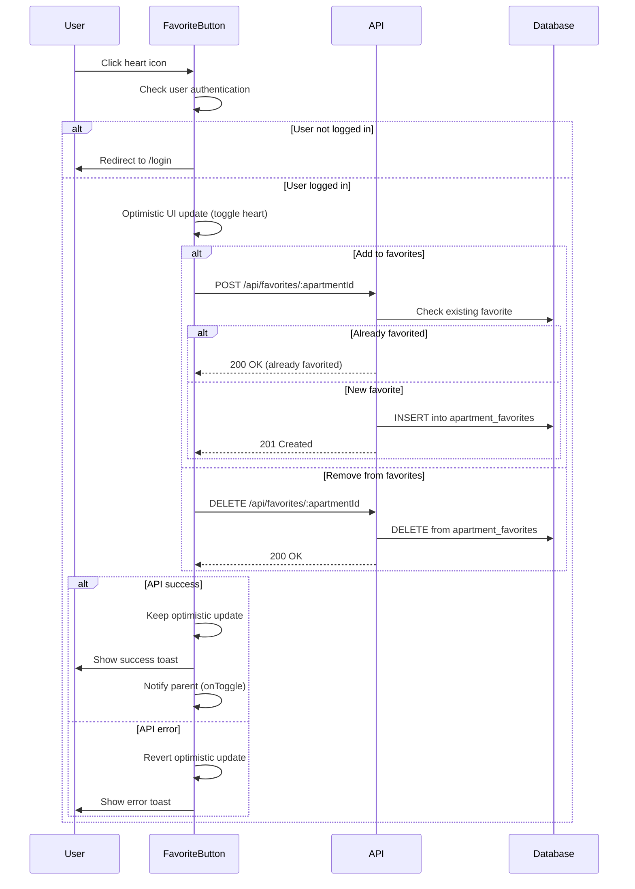
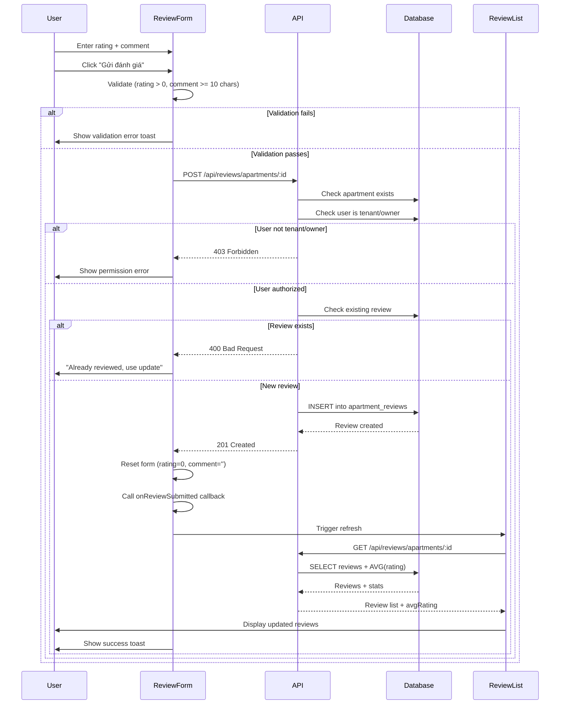
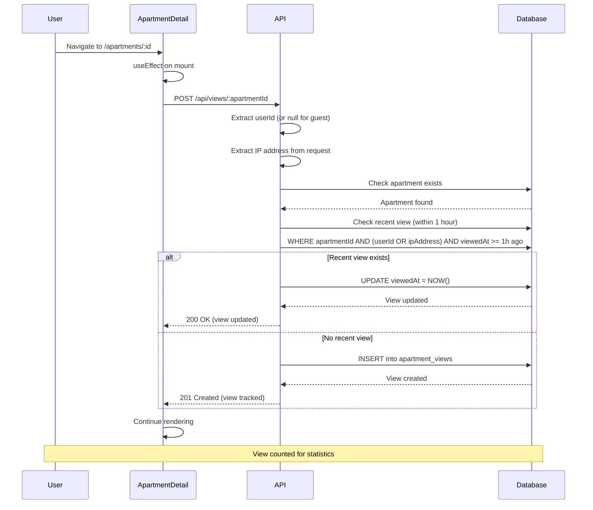
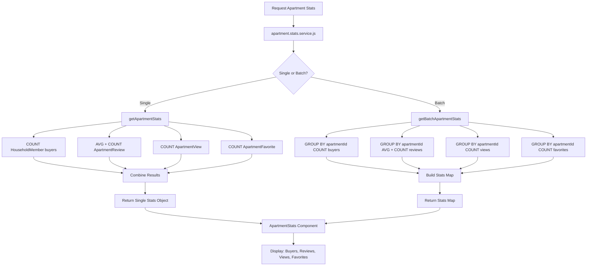
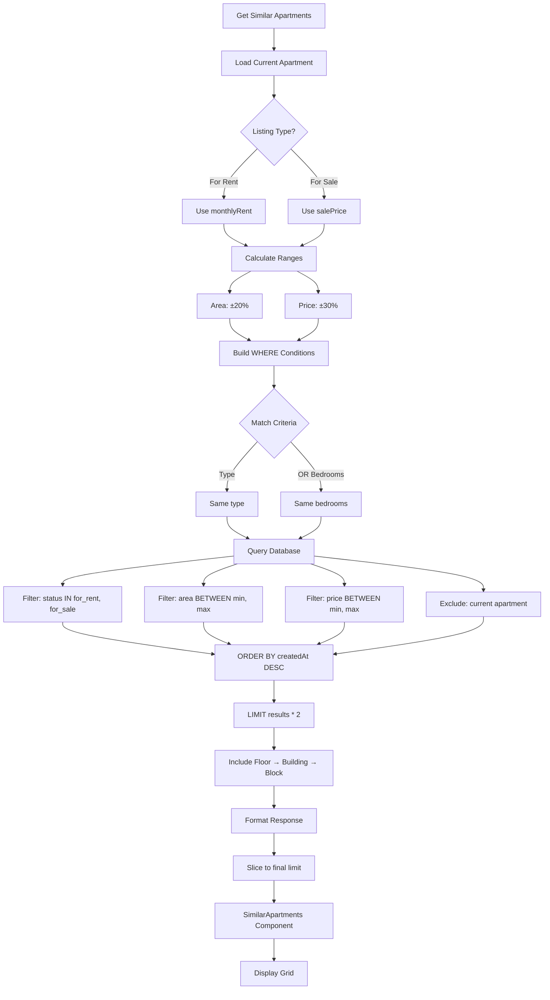

# BT08 - User Engagement Features (PHẦN 2: Frontend & Workflows)

## 📁 Cấu trúc Frontend

```
lab05_ManageBuilding/frontend/src/
├── components/
│   ├── FavoriteButton.jsx        # Heart icon toggle button
│   ├── ReviewForm.jsx            # 5-star rating + comment form
│   ├── ReviewList.jsx            # Display reviews with edit/delete
│   ├── ApartmentStats.jsx        # Stats cards (buyers, reviews, views, favorites)
│   └── SimilarApartments.jsx     # Grid of similar apartments
├── services/
│   └── api.js                    # API methods (favoriteAPI, reviewAPI, apartmentAPI)
└── pages/
    ├── ApartmentDetail.jsx       # Uses all engagement components
    └── Favorites.jsx             # User's favorite apartments list
```

## 🎯 Chi tiết Implementation - Frontend

### 1. Frontend Components

#### 1.1 FavoriteButton Component

```jsx
// components/FavoriteButton.jsx
import { useState, useEffect } from 'react';
import { useNavigate } from 'react-router-dom';
import { HeartIcon } from '@heroicons/react/24/outline';
import { HeartIcon as HeartIconSolid } from '@heroicons/react/24/solid';
import toast from 'react-hot-toast';
import { useAuth } from '../contexts/AuthContext';
import api from '../services/api';

const FavoriteButton = ({ 
    apartmentId, 
    initialFavorite = false, 
    onToggle, 
    size = 'md' 
}) => {
    const { user } = useAuth();
    const navigate = useNavigate();
    const [isFavorite, setIsFavorite] = useState(initialFavorite);
    const [loading, setLoading] = useState(false);

    useEffect(() => {
        setIsFavorite(initialFavorite);
    }, [initialFavorite]);

    const handleToggle = async (e) => {
        e.preventDefault();
        e.stopPropagation();

        if (!user) {
            toast.error('Vui lòng đăng nhập để thêm yêu thích');
            navigate('/login');
            return;
        }

        setLoading(true);

        // Optimistic UI update
        const previousState = isFavorite;
        setIsFavorite(!isFavorite);

        try {
            if (isFavorite) {
                await api.delete(`/favorites/${apartmentId}`);
                toast.success('Đã xóa khỏi danh sách yêu thích');
            } else {
                await api.post(`/favorites/${apartmentId}`);
                toast.success('Đã thêm vào danh sách yêu thích');
            }

            // Notify parent component
            if (onToggle) {
                onToggle(!isFavorite);
            }
        } catch (error) {
            // Revert optimistic update on error
            setIsFavorite(previousState);
            console.error('Error toggling favorite:', error);
            toast.error(
                error.response?.data?.message ||
                'Không thể cập nhật yêu thích. Vui lòng thử lại.'
            );
        } finally {
            setLoading(false);
        }
    };

    const sizeClasses = {
        sm: 'w-5 h-5',
        md: 'w-6 h-6',
        lg: 'w-8 h-8'
    };

    return (
        <button
            onClick={handleToggle}
            disabled={loading}
            className={`
                p-2 rounded-full transition-all duration-200
                hover:bg-gray-100 active:scale-95
                disabled:opacity-50 disabled:cursor-not-allowed
                ${loading ? 'animate-pulse' : ''}
            `}
            title={isFavorite ? 'Bỏ yêu thích' : 'Thêm vào yêu thích'}
            aria-label={isFavorite ? 'Remove from favorites' : 'Add to favorites'}
        >
            {isFavorite ? (
                <HeartIconSolid
                    className={`${sizeClasses[size]} text-red-500`}
                />
            ) : (
                <HeartIcon
                    className={`${sizeClasses[size]} text-gray-600 hover:text-red-500`}
                />
            )}
        </button>
    );
};

export default FavoriteButton;
```

**Component features**:
- **Optimistic UI**: Update UI trước khi API response (better UX)
- **Rollback on error**: Revert state nếu API call fails
- **Auth check**: Redirect to login nếu user chưa đăng nhập
- **Heroicons**: Outline vs Solid icons cho empty/filled states
- **Size variants**: sm, md, lg props
- **Event propagation**: stopPropagation() tránh trigger parent click events

#### 1.2 ReviewForm Component

```jsx
// components/ReviewForm.jsx
import { useState } from 'react';
import { StarIcon } from '@heroicons/react/24/solid';
import { StarIcon as StarIconOutline } from '@heroicons/react/24/outline';
import toast from 'react-hot-toast';
import { reviewAPI } from '../services/api';

const ReviewForm = ({ apartmentId, onReviewSubmitted }) => {
    const [rating, setRating] = useState(0);
    const [comment, setComment] = useState('');
    const [hoveredRating, setHoveredRating] = useState(0);
    const [loading, setLoading] = useState(false);

    const handleSubmit = async (e) => {
        e.preventDefault();

        if (rating === 0) {
            toast.error('Vui lòng chọn số sao đánh giá');
            return;
        }

        if (comment.trim().length < 10) {
            toast.error('Nhận xét phải có ít nhất 10 ký tự');
            return;
        }

        setLoading(true);

        try {
            const response = await reviewAPI.create(apartmentId, { rating, comment });
            toast.success('Đã gửi đánh giá thành công!');

            // Reset form
            setRating(0);
            setComment('');

            // Notify parent
            if (onReviewSubmitted) {
                onReviewSubmitted(response.data.data);
            }
        } catch (error) {
            console.error('Error submitting review:', error);
            toast.error(
                error.response?.data?.message ||
                'Không thể gửi đánh giá. Vui lòng thử lại.'
            );
        } finally {
            setLoading(false);
        }
    };

    return (
        <div className="bg-white rounded-lg shadow p-6">
            <h3 className="text-lg font-semibold mb-4">Đánh giá căn hộ</h3>

            <form onSubmit={handleSubmit}>
                {/* Star Rating */}
                <div className="mb-4">
                    <label className="block text-sm font-medium text-gray-700 mb-2">
                        Đánh giá của bạn <span className="text-red-500">*</span>
                    </label>
                    <div className="flex gap-2">
                        {[1, 2, 3, 4, 5].map((star) => (
                            <button
                                key={star}
                                type="button"
                                onClick={() => setRating(star)}
                                onMouseEnter={() => setHoveredRating(star)}
                                onMouseLeave={() => setHoveredRating(0)}
                                className="focus:outline-none transition-transform hover:scale-110"
                            >
                                {star <= (hoveredRating || rating) ? (
                                    <StarIcon className="w-8 h-8 text-yellow-400" />
                                ) : (
                                    <StarIconOutline className="w-8 h-8 text-gray-300" />
                                )}
                            </button>
                        ))}
                        {rating > 0 && (
                            <span className="ml-2 text-sm text-gray-600 self-center">
                                {rating} sao
                            </span>
                        )}
                    </div>
                </div>

                {/* Comment */}
                <div className="mb-4">
                    <label className="block text-sm font-medium text-gray-700 mb-2">
                        Nhận xét của bạn <span className="text-red-500">*</span>
                    </label>
                    <textarea
                        value={comment}
                        onChange={(e) => setComment(e.target.value)}
                        placeholder="Chia sẻ trải nghiệm của bạn về căn hộ này..."
                        rows={4}
                        maxLength={2000}
                        className="w-full px-3 py-2 border border-gray-300 rounded-lg focus:ring-2 focus:ring-blue-500 focus:border-transparent"
                    />
                    <p className="text-sm text-gray-500 mt-1">
                        {comment.length}/2000 ký tự (tối thiểu 10)
                    </p>
                </div>

                {/* Submit Button */}
                <button
                    type="submit"
                    disabled={loading || rating === 0 || comment.trim().length < 10}
                    className={`
                        w-full py-2 px-4 rounded-lg font-medium transition-colors
                        ${loading || rating === 0 || comment.trim().length < 10
                            ? 'bg-gray-300 text-gray-500 cursor-not-allowed'
                            : 'bg-blue-600 text-white hover:bg-blue-700'
                        }
                    `}
                >
                    {loading ? 'Đang gửi...' : 'Gửi đánh giá'}
                </button>
            </form>
        </div>
    );
};

export default ReviewForm;
```

**Form features**:
- **Interactive stars**: Hover preview + click to select
- **Client-side validation**: Rating required, comment min 10 chars
- **Character counter**: Real-time feedback (current/max)
- **Disabled state**: Button disabled until valid input
- **Reset on submit**: Clear form sau khi submit thành công
- **Parent callback**: Notify parent để refresh review list

#### 1.3 ReviewList Component

```jsx
// components/ReviewList.jsx
import { useState, useEffect } from 'react';
import { StarIcon } from '@heroicons/react/24/solid';
import { PencilIcon, TrashIcon } from '@heroicons/react/24/outline';
import toast from 'react-hot-toast';
import { reviewAPI } from '../services/api';
import { useAuth } from '../contexts/AuthContext';

const ReviewList = ({ apartmentId }) => {
    const { user } = useAuth();
    const [reviews, setReviews] = useState([]);
    const [avgRating, setAvgRating] = useState(0);
    const [totalReviews, setTotalReviews] = useState(0);
    const [loading, setLoading] = useState(true);
    const [page, setPage] = useState(1);
    const [totalPages, setTotalPages] = useState(1);
    const [editingReview, setEditingReview] = useState(null);
    const [editRating, setEditRating] = useState(0);
    const [editComment, setEditComment] = useState('');

    useEffect(() => {
        fetchReviews();
    }, [apartmentId, page]);

    const fetchReviews = async () => {
        setLoading(true);
        try {
            const response = await reviewAPI.getByApartment(apartmentId, page);
            setReviews(response.data.data.reviews);
            setAvgRating(response.data.data.avgRating);
            setTotalReviews(response.data.data.totalReviews);
            setTotalPages(response.data.pagination.totalPages);
        } catch (error) {
            console.error('Error fetching reviews:', error);
            toast.error('Không thể tải đánh giá');
        } finally {
            setLoading(false);
        }
    };

    const handleEdit = (review) => {
        setEditingReview(review.id);
        setEditRating(review.rating);
        setEditComment(review.comment || '');
    };

    const handleCancelEdit = () => {
        setEditingReview(null);
        setEditRating(0);
        setEditComment('');
    };

    const handleUpdateReview = async (reviewId) => {
        if (editRating === 0) {
            toast.error('Vui lòng chọn số sao');
            return;
        }

        try {
            await reviewAPI.update(reviewId, { 
                rating: editRating, 
                comment: editComment 
            });
            toast.success('Đã cập nhật đánh giá');
            setEditingReview(null);
            fetchReviews();
        } catch (error) {
            console.error('Error updating review:', error);
            toast.error('Không thể cập nhật đánh giá');
        }
    };

    const handleDelete = async (reviewId) => {
        if (!confirm('Bạn có chắc muốn xóa đánh giá này?')) return;

        try {
            await reviewAPI.delete(reviewId);
            toast.success('Đã xóa đánh giá');
            fetchReviews();
        } catch (error) {
            console.error('Error deleting review:', error);
            toast.error('Không thể xóa đánh giá');
        }
    };

    const formatDate = (dateString) => {
        const date = new Date(dateString);
        return date.toLocaleDateString('vi-VN', {
            year: 'numeric',
            month: 'long',
            day: 'numeric'
        });
    };

    if (loading) {
        return (
            <div className="bg-white rounded-lg shadow p-6">
                <div className="animate-pulse space-y-4">
                    <div className="h-4 bg-gray-200 rounded w-1/4"></div>
                    <div className="h-20 bg-gray-200 rounded"></div>
                </div>
            </div>
        );
    }

    return (
        <div className="bg-white rounded-lg shadow p-6">
            <div className="flex items-center justify-between mb-6">
                <h3 className="text-lg font-semibold">
                    Đánh giá ({totalReviews})
                </h3>
                {totalReviews > 0 && (
                    <div className="flex items-center gap-2">
                        <StarIcon className="w-5 h-5 text-yellow-400" />
                        <span className="text-lg font-semibold">{avgRating}</span>
                        <span className="text-sm text-gray-500">/ 5.0</span>
                    </div>
                )}
            </div>

            {reviews.length === 0 ? (
                <p className="text-gray-500 text-center py-8">
                    Chưa có đánh giá nào
                </p>
            ) : (
                <div className="space-y-4">
                    {reviews.map((review) => (
                        <div key={review.id} className="border-b pb-4 last:border-b-0">
                            {editingReview === review.id ? (
                                // Edit mode
                                <div className="space-y-3">
                                    <div className="flex gap-1">
                                        {[1, 2, 3, 4, 5].map((star) => (
                                            <button
                                                key={star}
                                                onClick={() => setEditRating(star)}
                                                type="button"
                                            >
                                                <StarIcon
                                                    className={`w-6 h-6 ${
                                                        star <= editRating
                                                            ? 'text-yellow-400'
                                                            : 'text-gray-300'
                                                    }`}
                                                />
                                            </button>
                                        ))}
                                    </div>
                                    <textarea
                                        value={editComment}
                                        onChange={(e) => setEditComment(e.target.value)}
                                        rows={3}
                                        className="w-full border rounded-lg p-2"
                                    />
                                    <div className="flex gap-2">
                                        <button
                                            onClick={() => handleUpdateReview(review.id)}
                                            className="px-4 py-2 bg-blue-600 text-white rounded-lg"
                                        >
                                            Lưu
                                        </button>
                                        <button
                                            onClick={handleCancelEdit}
                                            className="px-4 py-2 bg-gray-300 rounded-lg"
                                        >
                                            Hủy
                                        </button>
                                    </div>
                                </div>
                            ) : (
                                // Display mode
                                <div>
                                    <div className="flex items-start justify-between mb-2">
                                        <div>
                                            <p className="font-semibold">
                                                {review.user?.fullName || 'Anonymous'}
                                            </p>
                                            <div className="flex items-center gap-2 mt-1">
                                                <div className="flex">
                                                    {[...Array(5)].map((_, i) => (
                                                        <StarIcon
                                                            key={i}
                                                            className={`w-4 h-4 ${
                                                                i < review.rating
                                                                    ? 'text-yellow-400'
                                                                    : 'text-gray-300'
                                                            }`}
                                                        />
                                                    ))}
                                                </div>
                                                <span className="text-sm text-gray-500">
                                                    {formatDate(review.createdAt)}
                                                </span>
                                            </div>
                                        </div>
                                        {user?.id === review.userId && (
                                            <div className="flex gap-2">
                                                <button
                                                    onClick={() => handleEdit(review)}
                                                    className="text-blue-600 hover:text-blue-700"
                                                >
                                                    <PencilIcon className="w-5 h-5" />
                                                </button>
                                                <button
                                                    onClick={() => handleDelete(review.id)}
                                                    className="text-red-600 hover:text-red-700"
                                                >
                                                    <TrashIcon className="w-5 h-5" />
                                                </button>
                                            </div>
                                        )}
                                    </div>
                                    <p className="text-gray-700">{review.comment}</p>
                                </div>
                            )}
                        </div>
                    ))}
                </div>
            )}

            {/* Pagination */}
            {totalPages > 1 && (
                <div className="flex justify-center gap-2 mt-6">
                    <button
                        onClick={() => setPage(p => Math.max(1, p - 1))}
                        disabled={page === 1}
                        className="px-4 py-2 border rounded-lg disabled:opacity-50"
                    >
                        Trước
                    </button>
                    <span className="px-4 py-2">
                        Trang {page} / {totalPages}
                    </span>
                    <button
                        onClick={() => setPage(p => Math.min(totalPages, p + 1))}
                        disabled={page === totalPages}
                        className="px-4 py-2 border rounded-lg disabled:opacity-50"
                    >
                        Sau
                    </button>
                </div>
            )}
        </div>
    );
};

export default ReviewList;
```

**List features**:
- **Inline editing**: Toggle edit mode cho own reviews
- **Permission check**: Chỉ show edit/delete buttons cho own reviews
- **Pagination**: Navigate qua pages nếu có nhiều reviews
- **Average rating display**: Show tổng overview ở header
- **Empty state**: Friendly message khi chưa có reviews
- **Loading skeleton**: Animate pulse during fetch

#### 1.4 ApartmentStats Component

```jsx
// components/ApartmentStats.jsx
import { UserGroupIcon, StarIcon, EyeIcon, HeartIcon } from '@heroicons/react/24/outline';

const ApartmentStats = ({ stats }) => {
    if (!stats) return null;

    const formatNumber = (num) => {
        if (num >= 1000) {
            return (num / 1000).toFixed(1) + 'k';
        }
        return num.toString();
    };

    const statItems = [
        {
            icon: UserGroupIcon,
            label: 'Đã thuê/mua',
            value: stats.buyerCount,
            color: 'text-green-600',
            bgColor: 'bg-green-50'
        },
        {
            icon: StarIcon,
            label: 'Đánh giá',
            value: stats.reviewCount > 0 
                ? `${stats.avgRating}★ (${stats.reviewCount})` 
                : 'Chưa có',
            color: 'text-yellow-600',
            bgColor: 'bg-yellow-50',
            hideZero: false
        },
        {
            icon: EyeIcon,
            label: 'Lượt xem',
            value: formatNumber(stats.viewCount),
            color: 'text-blue-600',
            bgColor: 'bg-blue-50'
        },
        {
            icon: HeartIcon,
            label: 'Yêu thích',
            value: stats.favoriteCount,
            color: 'text-red-600',
            bgColor: 'bg-red-50'
        }
    ];

    return (
        <div className="grid grid-cols-2 md:grid-cols-4 gap-4 my-6">
            {statItems.map((item, index) => {
                const Icon = item.icon;
                const displayValue = typeof item.value === 'number' && item.hideZero !== false
                    ? (item.value || 0)
                    : item.value;

                return (
                    <div
                        key={index}
                        className={`${item.bgColor} rounded-lg p-4 transition-transform hover:scale-105`}
                    >
                        <div className="flex items-center gap-3">
                            <div className={`${item.color}`}>
                                <Icon className="w-6 h-6" />
                            </div>
                            <div>
                                <p className="text-sm text-gray-600">{item.label}</p>
                                <p className={`text-lg font-semibold ${item.color}`}>
                                    {displayValue}
                                </p>
                            </div>
                        </div>
                    </div>
                );
            })}
        </div>
    );
};

export default ApartmentStats;
```

**Stats display features**:
- **Icon + color coding**: Visual distinction cho từng metric
- **Number formatting**: 1000+ → 1k notation
- **Responsive grid**: 2 cols mobile, 4 cols desktop
- **Hover effect**: Scale-up animation
- **Conditional display**: "Chưa có" cho reviews nếu 0

#### 1.5 SimilarApartments Component

```jsx
// components/SimilarApartments.jsx
import { useState, useEffect } from 'react';
import { useNavigate } from 'react-router-dom';
import { apartmentAPI } from '../services/api';
import toast from 'react-hot-toast';

const SimilarApartments = ({ apartmentId, currentType }) => {
    const navigate = useNavigate();
    const [apartments, setApartments] = useState([]);
    const [loading, setLoading] = useState(true);

    useEffect(() => {
        fetchSimilarApartments();
    }, [apartmentId]);

    const fetchSimilarApartments = async () => {
        setLoading(true);
        try {
            const response = await apartmentAPI.getSimilar(apartmentId, 6);
            setApartments(response.data.data);
        } catch (error) {
            console.error('Error fetching similar apartments:', error);
            toast.error('Không thể tải căn hộ tương tự');
        } finally {
            setLoading(false);
        }
    };

    const formatPrice = (price) => {
        if (price >= 1000000000) {
            return `${(price / 1000000000).toFixed(2)} tỷ`;
        }
        return `${(price / 1000000).toFixed(1)} triệu`;
    };

    if (loading) {
        return (
            <div className="mt-8">
                <h3 className="text-xl font-semibold mb-4">Căn hộ tương tự</h3>
                <div className="grid grid-cols-1 md:grid-cols-2 lg:grid-cols-3 gap-4">
                    {[...Array(3)].map((_, i) => (
                        <div key={i} className="animate-pulse">
                            <div className="h-48 bg-gray-200 rounded-lg mb-2"></div>
                            <div className="h-4 bg-gray-200 rounded w-3/4 mb-2"></div>
                            <div className="h-4 bg-gray-200 rounded w-1/2"></div>
                        </div>
                    ))}
                </div>
            </div>
        );
    }

    if (apartments.length === 0) {
        return null;
    }

    return (
        <div className="mt-8">
            <h3 className="text-xl font-semibold mb-4">Căn hộ tương tự</h3>
            <div className="grid grid-cols-1 md:grid-cols-2 lg:grid-cols-3 gap-6">
                {apartments.map((apt) => (
                    <div
                        key={apt.id}
                        onClick={() => navigate(`/apartments/${apt.id}`)}
                        className="bg-white rounded-lg shadow-md overflow-hidden cursor-pointer transition-transform hover:scale-105 hover:shadow-lg"
                    >
                        {/* Image */}
                        <div className="relative h-48 overflow-hidden">
                            
                            <div className="absolute top-2 right-2 bg-blue-600 text-white px-3 py-1 rounded-full text-sm font-medium">
                                {apt.mode === 'rent' ? 'Cho thuê' : 'Bán'}
                            </div>
                        </div>

                        {/* Content */}
                        <div className="p-4">
                            <h4 className="font-semibold text-lg mb-2">
                                Căn hộ {apt.code}
                            </h4>

                            <p className="text-sm text-gray-600 mb-2">
                                {apt.block} - {apt.building} - Tầng {apt.floor}
                            </p>

                            <div className="flex items-center gap-4 text-sm text-gray-600 mb-3">
                                <span>{apt.area}m²</span>
                                <span>•</span>
                                <span>{apt.bedrooms} PN</span>
                                <span>•</span>
                                <span>{apt.bathrooms} WC</span>
                            </div>

                            <div className="flex items-center justify-between">
                                <span className="text-xl font-bold text-blue-600">
                                    {formatPrice(apt.price)}
                                    {apt.mode === 'rent' && (
                                        <span className="text-sm font-normal">/tháng</span>
                                    )}
                                </span>
                                <span className="text-sm px-2 py-1 bg-gray-100 rounded">
                                    {apt.type.toUpperCase()}
                                </span>
                            </div>
                        </div>
                    </div>
                ))}
            </div>
        </div>
    );
};

export default SimilarApartments;
```

**Recommendation UI features**:
- **Grid layout**: Responsive 1/2/3 columns
- **Hover effects**: Scale + shadow animation
- **Click navigation**: Navigate to apartment detail
- **Mode badge**: Visual indicator cho rent/buy
- **Loading skeleton**: Show 3 placeholder cards
- **Conditional render**: Hide section nếu no results

### 2. API Service Methods

```javascript
// services/api.js (engagement methods)
import axios from 'axios';

const api = axios.create({
    baseURL: process.env.VITE_API_URL || 'http://localhost:5000/api',
    headers: {
        'Content-Type': 'application/json'
    }
});

// Favorites API
export const favoriteAPI = {
    add: (apartmentId) => api.post(`/favorites/${apartmentId}`),
    remove: (apartmentId) => api.delete(`/favorites/${apartmentId}`),
    getAll: (page = 1, limit = 20) => 
        api.get('/favorites', { params: { page, limit } }),
    check: (apartmentId) => api.get(`/favorites/${apartmentId}/check`)
};

// Reviews API
export const reviewAPI = {
    create: (apartmentId, data) => 
        api.post(`/reviews/apartments/${apartmentId}`, data),
    update: (reviewId, data) => 
        api.put(`/reviews/${reviewId}`, data),
    delete: (reviewId) => 
        api.delete(`/reviews/${reviewId}`),
    getByApartment: (apartmentId, page = 1, limit = 10) =>
        api.get(`/reviews/apartments/${apartmentId}`, { params: { page, limit } })
};

// Apartment API (stats & similar)
export const apartmentAPI = {
    getStats: (apartmentId) => 
        api.get(`/apartments/${apartmentId}/stats`),
    getSimilar: (apartmentId, limit = 6) =>
        api.get(`/apartments/${apartmentId}/similar`, { params: { limit } }),
    trackView: (apartmentId) => 
        api.post(`/views/${apartmentId}`)
};

export default api;
```

## 🔄 Cơ chế hoạt động

### Workflow 1: Favorite Flow



### Workflow 2: Review Flow



### Workflow 3: View Tracking Flow



### Workflow 4: Statistics Aggregation Flow



### Workflow 5: Similar Apartments Algorithm



## 📊 Ví dụ cụ thể

### 1. Integration trong ApartmentDetail Page

```jsx
// pages/ApartmentDetail.jsx
import { useState, useEffect } from 'react';
import { useParams } from 'react-router-dom';
import FavoriteButton from '../components/FavoriteButton';
import ReviewForm from '../components/ReviewForm';
import ReviewList from '../components/ReviewList';
import ApartmentStats from '../components/ApartmentStats';
import SimilarApartments from '../components/SimilarApartments';
import { apartmentAPI } from '../services/api';

const ApartmentDetail = () => {
    const { id } = useParams();
    const [apartment, setApartment] = useState(null);
    const [stats, setStats] = useState(null);
    const [isFavorite, setIsFavorite] = useState(false);

    useEffect(() => {
        loadApartment();
        loadStats();
        trackView();
    }, [id]);

    const loadApartment = async () => {
        const response = await apartmentAPI.getById(id);
        setApartment(response.data.data);
        setIsFavorite(response.data.data.isFavorite || false);
    };

    const loadStats = async () => {
        const response = await apartmentAPI.getStats(id);
        setStats(response.data.data);
    };

    const trackView = async () => {
        await apartmentAPI.trackView(id);
    };

    const handleReviewSubmitted = () => {
        loadStats(); // Refresh stats after new review
    };

    if (!apartment) return <div>Loading...</div>;

    return (
        <div className="max-w-7xl mx-auto p-6">
            {/* Header with Favorite */}
            <div className="flex justify-between items-start mb-6">
                <h1 className="text-3xl font-bold">Căn hộ {apartment.apartmentNumber}</h1>
                <FavoriteButton
                    apartmentId={apartment.id}
                    initialFavorite={isFavorite}
                    onToggle={setIsFavorite}
                    size="lg"
                />
            </div>

            {/* Stats Section */}
            <ApartmentStats stats={stats} />

            {/* Main Content */}
            <div className="grid grid-cols-1 lg:grid-cols-3 gap-6">
                <div className="lg:col-span-2">
                    {/* Apartment details here */}
                    
                    {/* Reviews */}
                    <ReviewList apartmentId={apartment.id} />
                </div>

                <div className="lg:col-span-1">
                    {/* Sidebar */}
                    <ReviewForm
                        apartmentId={apartment.id}
                        onReviewSubmitted={handleReviewSubmitted}
                    />
                </div>
            </div>

            {/* Similar Apartments */}
            <SimilarApartments
                apartmentId={apartment.id}
                currentType={apartment.type}
            />
        </div>
    );
};

export default ApartmentDetail;
```

### 2. Testing với curl

```bash
# Add to favorites
curl -X POST http://localhost:5000/api/favorites/15 \
  -H "Authorization: Bearer YOUR_JWT_TOKEN" \
  -H "Content-Type: application/json"

# Response:
{
  "success": true,
  "message": "Added to favorites",
  "isFavorite": true
}

# Get user's favorites
curl -X GET "http://localhost:5000/api/favorites?page=1&limit=10" \
  -H "Authorization: Bearer YOUR_JWT_TOKEN"

# Response:
{
  "success": true,
  "data": [
    {
      "id": 1,
      "apartmentId": 15,
      "favoritedAt": "2025-12-10T10:30:00.000Z",
      "apartment": {
        "id": 15,
        "apartmentNumber": "302",
        "type": "2bhk",
        "area": 65,
        "monthlyRent": 7500000,
        "status": "for_rent",
        "block": "Block S",
        "building": "Building 01",
        "floor": 3
      }
    }
  ],
  "pagination": {
    "total": 1,
    "page": 1,
    "limit": 10,
    "totalPages": 1
  }
}

# Create review
curl -X POST http://localhost:5000/api/reviews/apartments/15 \
  -H "Authorization: Bearer YOUR_JWT_TOKEN" \
  -H "Content-Type: application/json" \
  -d '{
    "rating": 5,
    "comment": "Căn hộ rất đẹp, sạch sẽ, view tốt. Chủ nhà thân thiện!"
  }'

# Response:
{
  "success": true,
  "message": "Review created successfully",
  "data": {
    "id": 1,
    "apartmentId": 15,
    "userId": 3,
    "rating": 5,
    "comment": "Căn hộ rất đẹp, sạch sẽ, view tốt. Chủ nhà thân thiện!",
    "createdAt": "2025-12-10T10:35:00.000Z",
    "updatedAt": "2025-12-10T10:35:00.000Z"
  }
}

# Get apartment stats
curl -X GET http://localhost:5000/api/apartments/15/stats \
  -H "Authorization: Bearer YOUR_JWT_TOKEN"

# Response:
{
  "success": true,
  "data": {
    "apartmentId": 15,
    "buyerCount": 2,
    "reviewCount": 5,
    "avgRating": 4.6,
    "viewCount": 127,
    "favoriteCount": 8
  }
}

# Get similar apartments
curl -X GET "http://localhost:5000/api/apartments/15/similar?limit=6" \
  -H "Authorization: Bearer YOUR_JWT_TOKEN"

# Response:
{
  "success": true,
  "data": [
    {
      "id": 18,
      "code": "305",
      "type": "2bhk",
      "area": 68,
      "bedrooms": 2,
      "bathrooms": 2,
      "price": 8000000,
      "mode": "rent",
      "status": "for_rent",
      "images": ["https://..."],
      "block": "Block S",
      "building": "Building 01",
      "floor": 3
    }
  ]
}

# Track view (works for guests too)
curl -X POST http://localhost:5000/api/views/15 \
  -H "Content-Type: application/json"

# Response:
{
  "success": true,
  "message": "View tracked",
  "viewId": 245
}
```

## 🎯 Kết quả đạt được

| Chức năng | Mô tả | Status |
|-----------|-------|--------|
| **Favorite System** | Bookmark apartments, toggle heart icon, list view | ✅ Hoàn thành |
| **Review System** | 5-star rating + comment, edit/delete own reviews | ✅ Hoàn thành |
| **View Tracking** | Track cả authenticated users và guests via IP | ✅ Hoàn thành |
| **Statistics Dashboard** | Real-time aggregation: buyers, reviews, views, favorites | ✅ Hoàn thành |
| **Similar Apartments** | Smart recommendation algorithm (type, bedrooms, area, price) | ✅ Hoàn thành |
| **Optimistic UI** | Instant feedback với rollback on error | ✅ Hoàn thành |
| **Permission Control** | Only tenants/owners review, only owners edit/delete | ✅ Hoàn thành |
| **Guest Support** | View tracking without login required | ✅ Hoàn thành |
| **Deduplication** | Prevent duplicate favorites/reviews, 1-hour view window | ✅ Hoàn thành |
| **Batch Operations** | Efficient stats loading cho multiple apartments | ✅ Hoàn thành |
| **Responsive UI** | Mobile-first design với Tailwind CSS | ✅ Hoàn thành |
| **Loading States** | Skeleton screens cho better UX | ✅ Hoàn thành |

## 🚀 Lệnh chạy project

```bash
# Backend
cd lab05_ManageBuilding/backend
npm install
npm run seed  # Initialize data including engagement tables
npm run dev   # Start on http://localhost:5000

# Frontend
cd lab05_ManageBuilding/frontend
npm install
npm run dev   # Start on http://localhost:5173
```

## 💡 Điểm mạnh

### 1. User Engagement Optimization
- **Favorites**: Reduce search time, increase return visits
- **Reviews**: Build trust, social proof cho apartments
- **View tracking**: Understand user behavior, popular apartments
- **Similar apartments**: Keep users browsing longer

### 2. Performance Optimization
- **Optimistic UI**: Instant feedback không cần chờ API
- **Batch statistics**: 1 query thay vì N queries cho N apartments
- **Deduplication**: Prevent inflated view counts
- **Indexed queries**: Database indexes trên frequently queried columns

### 3. Data Integrity
- **Unique constraints**: Prevent duplicate favorites/reviews
- **Cascade deletes**: Tự động cleanup khi user/apartment deleted
- **Transaction safety**: Atomic operations cho critical updates
- **Validation layers**: Database + API + Client validation

### 4. Authorization & Security
- **Tenant/owner validation**: Chỉ actual tenants/owners review được
- **Ownership checks**: User chỉ edit/delete own reviews
- **Guest tracking**: IP-based deduplication for anonymous users
- **JWT authentication**: Secure API endpoints

### 5. Algorithm Intelligence
- **Flexible matching**: Type OR bedrooms (more results)
- **Range tolerance**: ±20% area, ±30% price
- **Mode-specific**: Rent với rent, buy với buy
- **Availability filter**: Chỉ show available apartments

### 6. Developer Experience
- **Component reusability**: FavoriteButton, ReviewForm reusable anywhere
- **Service layer**: Clean separation of concerns
- **Error handling**: Graceful degradation với user-friendly messages
- **TypeScript-ready**: Easy to add type definitions

### 7. User Experience
- **Real-time feedback**: Toast notifications cho actions
- **Loading states**: Skeleton screens prevent layout shift
- **Empty states**: Friendly messages khi no data
- **Inline editing**: No modal required cho review updates
- **Hover previews**: Star rating hover effect

---

**Tổng kết**: BT08 thành công xây dựng một **comprehensive engagement system** với Favorites, Reviews, Views, Statistics, và Similar Apartments recommendation. System tối ưu cho cả performance (batch operations, optimistic UI) và user experience (instant feedback, smart recommendations). Integration của tất cả components tạo nên một cohesive apartment marketplace platform.

---

## 📝 Notes

**2 files đã được tạo**:
1. **BT08.md** - Backend implementation (Models, Controllers, Services)
2. **BT08_PART2.md** - Frontend implementation (Components, Workflows, Examples)

Để đọc đầy đủ, bạn cần đọc **CẢ 2 FILES** theo thứ tự! 🎯
