# lab05_ManageBuilding - Comprehensive Workflow Diagrams

Tài liệu này tổng hợp tất cả workflows chính của hệ thống lab05_ManageBuilding với Mermaid diagrams.

## 📑 Mục lục

1. [Authentication Flow](#1-authentication-flow)
2. [Lease Request Workflow](#2-lease-request-workflow)
3. [Cart & Checkout Flow](#3-cart--checkout-flow)
4. [Engagement Features Flow](#4-engagement-features-flow)
5. [Search & Filter Flow](#5-search--filter-flow)
6. [3D Building Map Interaction](#6-3d-building-map-interaction)
7. [Role-Based Access Control Flow](#7-role-based-access-control-flow)
8. [Payment Processing Flow](#8-payment-processing-flow)

---

## 1. Authentication Flow

### 1.1 Login & JWT Token Generation


### 1.2 Protected Route Access with JWT


---

## 2. Lease Request Workflow

### 2.1 Complete Lease Request Lifecycle


### 2.2 Lease Request Status States


---

## 3. Cart & Checkout Flow

### 3.1 Cart Operations & Checkout


### 3.2 GraphQL Cart Operations

```mermaid
graph TD
    A[GraphQL Endpoint /graphql] --> B{Operation Type}
    
    B -->|Query| C[myCart]
    B -->|Query| D[cartSummary]
    B -->|Mutation| E[addToCart]
    B -->|Mutation| F[updateCartItem]
    B -->|Mutation| G[removeFromCart]
    B -->|Mutation| H[toggleCartItemSelection]
    B -->|Mutation| I[selectAllCartItems]
    B -->|Mutation| J[clearCart]
    B -->|Mutation| K[checkoutCart]
    
    C --> L[CartService.getCartSummary]
    D --> L
    E --> M[CartService.addToCart]
    F --> N[CartService.updateCartItem]
    G --> O[CartService.removeFromCart]
    H --> P[CartService.toggleSelection]
    I --> Q[CartService.selectAll]
    J --> R[CartService.clearCart]
    K --> S[CartService.checkoutCart]
    
    L --> T[Database Queries]
    M --> T
    N --> T
    O --> T
    P --> T
    Q --> T
    R --> T
    S --> T
    
    T --> U[Response with CartItem/CartResponse/CheckoutResult]
    U --> V[Frontend Updates UI]
    
    style K fill:#ff6b6b
    style S fill:#ff6b6b
    note right of K: Most complex operation<br/>Handles payments,<br/>role upgrades,<br/>status updates
```

---

## 4. Engagement Features Flow

### 4.1 Favorite, Review, View Tracking


### 4.2 Similar Apartments Recommendation

```mermaid
graph TD
    A[User views Apartment ID=15] --> B[Load Current Apartment]
    
    B --> C{Apartment Type?}
    C -->|type: 2bhk| D[Type = 2bhk]
    C -->|bedrooms: 2| E[Bedrooms = 2]
    
    B --> F{Listing Mode?}
    F -->|For Rent| G[Price = monthlyRent]
    F -->|For Sale| H[Price = salePrice]
    
    D --> I[Calculate Area Range]
    E --> I
    G --> J[Calculate Price Range]
    H --> J
    
    I --> K[area BETWEEN 52-78m²<br/>80% - 120% of 65m²]
    J --> L[price BETWEEN 5.25M-9.75M<br/>70% - 130% of 7.5M]
    
    K --> M[Build WHERE Clause]
    L --> M
    
    M --> N{Match Criteria}
    N -->|OR| O[type = '2bhk']
    N -->|OR| P[bedrooms = 2]
    
    O --> Q[Filter: status IN for_rent, for_sale]
    P --> Q
    
    Q --> R[Exclude: id != 15]
    R --> S[Same listing mode: isListedForRent = true]
    
    S --> T[ORDER BY createdAt DESC]
    T --> U[LIMIT 12 - Get extra for filtering]
    
    U --> V[Include Floor → Building → Block]
    V --> W[Format Response]
    W --> X[Slice to limit=6]
    X --> Y[Return Similar Apartments]
    
    Y --> Z[Display in Grid]
    Z --> AA[User clicks similar apartment]
    AA --> A
    
    style A fill:#4CAF50
    style Y fill:#2196F3
    style Z fill:#FF9800
```



---

## 5. Search & Filter Flow

### 5.1 Fuzzy Search with Fuse.js

```mermaid
sequenceDiagram
    participant User
    participant SearchPage
    participant API
    participant SearchController
    participant FuseJS
    participant Database

    User->>SearchPage: Enter search query "can ho 2 phong ngu"
    User->>SearchPage: Apply filters (type, bedrooms, price range)
    User->>SearchPage: Click search
    
    SearchPage->>SearchPage: Debounce 300ms
    SearchPage->>API: GET /api/apartments/search?q=can ho 2 phong ngu&type=2bhk
    
    API->>SearchController: searchApartments(req, res)
    SearchController->>SearchController: Extract query + filters
    
    SearchController->>SearchController: normalize(query)
    Note over SearchController: Remove diacritics:<br/>"cần hộ" → "can ho"
    
    SearchController->>SearchController: Check if pure digit search
    
    alt Pure digit search (e.g., "302")
        SearchController->>Database: Exact match on apartmentNumber
        Database-->>SearchController: Matching apartments
    else Text search
        SearchController->>Database: Load all apartments with filters
        Database-->>SearchController: Filtered apartments
        
        SearchController->>SearchController: Build searchable text for each
        Note over SearchController: Combine: code, type, address,<br/>bedrooms, bathrooms, status
        
        SearchController->>FuseJS: Initialize Fuse with options
        Note over FuseJS: threshold: 0.3<br/>distance: 100<br/>keys: searchableText
        
        FuseJS->>FuseJS: Perform fuzzy search
        FuseJS-->>SearchController: Ranked results with scores
        
        SearchController->>SearchController: Filter by score threshold
        SearchController->>SearchController: Map to apartment objects
    end
    
    SearchController->>SearchController: Apply additional filters
    Note over SearchController: blockId, buildingId, floorId<br/>status, bedrooms, bathrooms<br/>area range, price range
    
    SearchController->>SearchController: Sort results (price/area/date)
    SearchController->>SearchController: Paginate (offset + limit)
    
    SearchController-->>API: Formatted results + pagination
    API-->>SearchPage: Search results
    
    SearchPage->>SearchPage: Update results grid
    SearchPage->>User: Display apartments
    
    User->>SearchPage: Change filters
    SearchPage->>API: New search request
    Note over SearchPage,Database: Repeat process with new filters
```



### 5.2 Search Strategy Decision Tree


---

## 6. 3D Building Map Interaction

### 6.1 Interactive Building Map Navigation


### 6.2 3D CSS Transform Hierarchy


---

## 7. Role-Based Access Control Flow

### 7.1 RBAC Authorization Check


### 7.2 Role Permission Matrix


---

## 8. Payment Processing Flow

### 8.1 Complete Payment Workflow


### 8.2 Payment Transaction State Machine


---

## 📊 Summary

Các workflows trên minh họa:

1. **Authentication Flow**: JWT token generation, refresh token mechanism, protected routes
2. **Lease Request Workflow**: Full lifecycle từ submit → approval/rejection → auto-cart creation
3. **Cart & Checkout Flow**: GraphQL operations, transaction management, payment processing
4. **Engagement Features**: Favorites, reviews, view tracking với optimistic UI
5. **Search & Filter**: Fuzzy search với Fuse.js, multi-filter combinations
6. **3D Building Map**: Interactive navigation với CSS 3D transforms
7. **RBAC**: Role-based access control với 7 roles
8. **Payment Processing**: Complete payment workflow với transaction safety

Tất cả workflows được thiết kế với:
- ✅ **Error handling**: Graceful failures với rollback
- ✅ **Transaction safety**: ACID properties cho critical operations
- ✅ **Optimistic UI**: Instant feedback cho better UX
- ✅ **Authorization**: Role-based và ownership checks
- ✅ **Validation**: Multi-layer validation (client, API, database)

---

**File này hoàn thành comprehensive workflow documentation cho lab05_ManageBuilding!** 🎯
